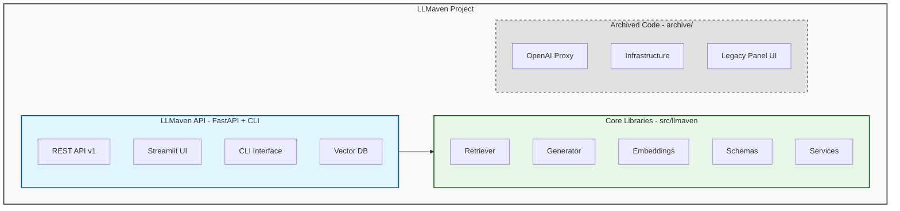
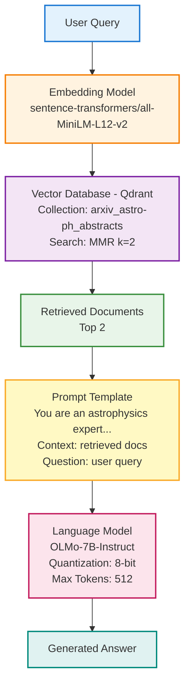

# AGENTS.md - LLMaven AI Assistant Guide

> **Purpose**: This document serves as the definitive technical reference for AI assistants working on the LLMaven codebase. It provides comprehensive architectural understanding, development patterns, and operational guidance.

---

## Quick Reference: Recent Architecture Changes

**IMPORTANT**: LLMaven has been refactored from a collection of standalone scripts into a modern, installable Python package:

### What Changed
- **Package Structure**: Code moved from `app/` and `core/` to `src/llmaven/` (standard Python package layout)
- **CLI Interface**: New `llmaven` command with `serve`, `ui`, and `version` subcommands
- **API Versioning**: Endpoints moved to `/v1/` prefix (was `/api/`)
- **Configuration**: Pydantic Settings with environment variable support
- **Schemas**: Explicit Pydantic models for request/response validation
- **Installability**: Package can be installed via `pip install -e .` or `pixi`

### Current Entry Points
```bash
# New (Recommended)
llmaven serve              # Start FastAPI backend
llmaven ui                 # Launch Streamlit frontend

# Legacy (Still Works)
pixi run serve-panel       # Original Panel UI
```

### Directory Mapping
| Old Location | New Location | Status |
|--------------|--------------|--------|
| `app/` | `src/llmaven/` | Migrated |
| `app/routers/` | `src/llmaven/v1/endpoints/` | Migrated |
| `core/` | `src/llmaven/core/` | Migrated |
| `frontend/` | `src/llmaven/frontend/` | Migrated |
| `proxy/` | `archive/proxy/` | Archived (unused) |
| `infra/` | `archive/infra/` | Archived (unused) |
| `legacy/` | `archive/legacy/` | Archived (unused) |

---

## Table of Contents

1. [Project Overview](#1-project-overview)
2. [Architecture](#2-architecture)
3. [Directory Structure](#3-directory-structure)
4. [Key Components](#4-key-components)
5. [Technology Stack](#5-technology-stack)
6. [Development Setup](#6-development-setup)
7. [Code Organization](#7-code-organization)
8. [Testing Strategy](#8-testing-strategy)
9. [API/Interfaces](#9-apiinterfaces)
10. [Data Flow](#10-data-flow)
11. [Important Files](#11-important-files)
12. [Common Tasks](#12-common-tasks)
13. [Gotchas and Pitfalls](#13-gotchas-and-pitfalls)
14. [Contributing Guidelines](#14-contributing-guidelines)

---

## 1. Project Overview

### Mission Statement

LLMaven is a scientific research tool that democratizes AI-based research by providing open, transparent, and useful AI software for scientists. The project leverages Retrieval Augmented Generation (RAG) to extend Large Language Models (LLMs) with domain-specific knowledge without requiring expensive model training or fine-tuning.

### Core Goals

1. **Accessibility**: Enable individual researchers without extensive AI/ML resources to leverage advanced LLMs
2. **Privacy-Aware**: Use RAG to handle data with privacy/IP concerns cost-effectively
3. **Domain Specialization**: Focus on astrophysics and astronomical research (e.g., Rubin Observatory/LSST data)
4. **Open Science**: Leverage publicly available datasets and academic knowledge bases

### Project Status

- **Primary Use Case**: Interactive chat application for astrophysics research queries
- **Current Focus**: Rubin Observatory (formerly LSST) documentation and arXiv astrophysics papers
- **Deployment**: Multi-environment architecture (RAG app, OpenAI proxy, infrastructure)

---

## 2. Architecture

### High-Level Architecture

LLMaven has been refactored into a modern, modular architecture with three distinct but related systems:



### Current Architecture (Post-Refactor)

The project recently underwent a major refactoring to create a modern, installable Python package with:

1. **LLMaven API Package** (src/llmaven/): Installable package with CLI and API
2. **Archived Code** (archive/): Unused components moved to archive:
   - OpenAI Proxy Service (archive/proxy/): Standalone authentication and logging proxy
   - Infrastructure as Code (archive/infra/): Azure resource provisioning
   - Legacy Applications (archive/legacy/): Original Panel-based chat UI

### Architectural Patterns

#### 1. RAG (Retrieval Augmented Generation) Pipeline

**Pattern**: Two-stage LLM enhancement
- **Stage 1: Retrieval** - Query vector database for relevant documents
- **Stage 2: Generation** - Use retrieved context to generate informed responses

**Why**: Extends LLM knowledge without expensive fine-tuning; handles domain-specific and recent information

**Implementation**:
```python
# Flow: User Query → Embed Query → Vector Search → Format Context → LLM Generation
retriever = Retriever(model_name=embedding_model)
retriever.create_vector_store(documents)  # or load existing
relevant_docs = retriever.retrieve_docs(query)
context = format_context(relevant_docs)
response = language_model.inference(prompt_with_context)
```

#### 2. Service Layer Architecture

**Pattern**: Separation of concerns with distinct service layers
- **Routers**: FastAPI endpoint handlers (`app/routers/`)
- **Services**: Business logic layer (`app/services/`)
- **Core**: Reusable ML/AI components (`core/`)

**Why**: Enables testing, reusability, and clear boundaries between concerns

#### 3. Proxy Pattern (OpenAI API)

**Pattern**: Transparent middleware proxy with logging and authentication
- Intercepts all OpenAI API calls
- Adds authentication, logging, and monitoring
- Preserves streaming behavior

**Why**: Centralize cost tracking, user authentication, and usage monitoring without client changes

#### 4. Infrastructure as Code (IaC)

**Pattern**: Pulumi-based declarative infrastructure
- Azure Storage Account (blob + tables)
- Automatic credential management
- Environment-based configuration

**Why**: Reproducible deployments, version-controlled infrastructure, team collaboration

---

## 3. Directory Structure

```
llmaven/
├── src/llmaven/                  # Main LLMaven package (installable)
│   ├── __init__.py              # Package initialization with version
│   ├── main.py                  # FastAPI application entry point
│   ├── cli.py                   # CLI commands (serve, ui, version)
│   ├── config.py                # Web service configuration
│   │
│   ├── v1/                      # API version 1 endpoints
│   │   ├── router.py            # Main v1 router aggregator
│   │   └── endpoints/           # Individual endpoint modules
│   │       ├── retrieve.py      # Document retrieval endpoint
│   │       └── generate.py      # Text generation endpoint
│   │
│   ├── schemas/                 # Pydantic request/response models
│   │   ├── retrieve.py          # RetrieveRequest schema
│   │   └── generate.py          # GenerationRequest schema
│   │
│   ├── services/                # Business logic layer
│   │   ├── retrieval_service.py # Retrieval orchestration
│   │   └── generation_service.py# Generation + model caching
│   │
│   ├── core/                    # Core ML/AI components
│   │   ├── embeddings/
│   │   │   └── embedding_model.py  # HuggingFace embeddings
│   │   ├── retriever/
│   │   │   └── retriever.py     # Qdrant vector DB operations
│   │   └── generator/
│   │       ├── language_model.py   # HuggingFace LLM with quantization
│   │       └── embedding_model.py  # Alternative embedding utilities
│   │
│   └── frontend/                # Streamlit UI components
│       ├── app.py               # Streamlit RAG chatbot interface
│       └── config.py            # Frontend-specific configuration
│
├── archive/                      # Archived code (unused)
│   ├── proxy/                   # OpenAI API proxy service (archived)
│   │   ├── main.py              # FastAPI proxy server
│   │   ├── auth.py              # Azure Table Storage authentication
│   │   ├── data_log.py          # Request/response logging
│   │   ├── requirements.txt     # Proxy-specific dependencies
│   │   ├── Dockerfile          # Multi-stage production container
│   │   └── .env.example        # Configuration template
│   │
│   ├── infra/                   # Infrastructure as Code (archived)
│   │   ├── __main__.py         # Pulumi program (storage + tables)
│   │   ├── users.py            # User management utilities
│   │   ├── Pulumi.yaml         # Pulumi project configuration
│   │   └── README.md           # Infrastructure setup guide
│   │
│   └── legacy/                  # Original/reference implementations (archived)
│       ├── rubin-panel-app.py  # Panel-based chat UI (original demo)
│       ├── rubin-app-gpu.py    # GPU-optimized variant
│       ├── download_models.py  # Model download utilities
│       ├── vector_store.py     # Legacy vector store utilities
│       └── notebooks/          # Jupyter notebooks for experiments
│
├── tests/                        # Test suite
│   ├── test_retriever.py        # Retrieval API integration tests
│   ├── test_generator.py        # Generation tests
│   └── debug_language_model.py  # Debugging utilities
│
├── eval/                         # Evaluation and data collection
│   └── Scrape-discourse.ipynb   # Data collection notebooks
│
├── docker/                       # Docker compose configurations
│   └── .env                     # Docker environment variables
│
├── .github/                      # GitHub configuration
│   ├── workflows/
│   │   └── proxy-container.yml  # Docker build/push for proxy (may be outdated)
│   ├── dependabot.yml           # Dependency updates
│   └── release.yml              # Release configuration
│
├── .devcontainer/               # Dev container configs
│   └── Dockerfile              # Development environment
│
├── pyproject.toml               # Python project metadata & dependencies
├── pixi.toml                    # Pixi package manager config
├── pixi.lock                    # Locked dependencies
├── .pre-commit-config.yaml      # Pre-commit hooks
├── .flake8                      # Linting configuration
├── AGENTS.md                    # This file - technical reference
└── README.md                    # User-facing documentation
```

### Directory Purposes

| Directory | Purpose | When to Modify |
|-----------|---------|----------------|
| `src/llmaven/` | Main installable package | Core API development, adding features |
| `src/llmaven/v1/` | API version 1 endpoints | Adding/modifying REST endpoints |
| `src/llmaven/core/` | ML/AI components | Changing retrieval/generation algorithms |
| `src/llmaven/services/` | Business logic | Orchestration and service-level logic |
| `src/llmaven/schemas/` | API contracts | Request/response data models |
| `src/llmaven/frontend/` | Streamlit UI | User interface changes |
| `archive/proxy/` | OpenAI API proxy (archived) | **Do not modify** - archived code |
| `archive/infra/` | Cloud infrastructure (archived) | **Do not modify** - archived code |
| `archive/legacy/` | Original implementations (archived) | **Do not modify** - reference only |
| `tests/` | Test suite | Adding tests for new features |
| `docker/` | Container orchestration | Multi-service deployment setup |

---

## 4. Key Components

### 4.1 CLI Interface (`src/llmaven/cli.py`)

**Responsibility**: Command-line interface for running LLMaven services

**Commands**:
```python
llmaven serve    # Start the FastAPI backend server
llmaven ui       # Launch the Streamlit frontend
llmaven version  # Display version information
```

**Key Features**:
- **serve**: Supports both development (uvicorn) and production (gunicorn) modes
- **ui**: Automatically launches Streamlit with configurable host/port
- **Environment-aware**: Development vs production configurations
- **Worker management**: Auto-calculates optimal worker count for production

**Usage Examples**:
```bash
# Development mode with auto-reload
llmaven serve --env development --reload

# Production mode with 4 workers
llmaven serve --env production --workers 4

# Launch UI on custom port
llmaven ui --port 8080 --no-browser

# Check version
llmaven version
```

**Design Decisions**:
- Uses Typer for CLI framework (type-safe, auto-documented)
- Supports both uvicorn (dev) and gunicorn (prod) deployment modes
- Integrated with package entry point for easy installation

---

### 4.2 FastAPI Application (`src/llmaven/main.py`)

**Responsibility**: Main REST API application with endpoints and middleware

**Key Features**:
- **CORS Middleware**: Configurable cross-origin support
- **Exception Handlers**: Consistent error response format
- **API Documentation**: Auto-generated OpenAPI/Swagger docs
- **Versioned Routes**: v1 API prefix for future compatibility

**Endpoints**:
```python
GET  /              # API information and available routes
GET  /ping          # Health check endpoint
GET  /docs          # Swagger UI documentation
GET  /redoc         # ReDoc documentation
/v1/retrieve/       # Document retrieval (see v1 endpoints)
/v1/generate/       # Text generation (see v1 endpoints)
```

**Configuration**:
- Environment-based via `config.py` (Pydantic Settings)
- Supports `.env` file with `API_` prefix
- CORS, title, description, version all configurable

---

### 4.3 API v1 Router (`src/llmaven/v1/router.py`)

**Responsibility**: Aggregate all v1 endpoints into single router

**Design Pattern**: Modular router composition
```python
router = APIRouter(prefix="/v1")
router.include_router(generate.router)  # /v1/generate
router.include_router(retrieve.router)  # /v1/retrieve
```

**Why Versioned**:
- Allows future API versions (v2, v3) without breaking changes
- Clear deprecation path for older endpoints
- Client compatibility across versions

---

### 4.4 Retriever (`src/llmaven/core/retriever/retriever.py`)

**Responsibility**: Manage vector database operations and document retrieval

**Key Methods**:
```python
class Retriever:
    def __init__(model_name: str, qdrant_path: str, collection_name: str)
    def create_vector_store(documents: list, collection_name: str) -> Qdrant
    def get_vector_store(qdrant_path: str, collection_name: str) -> Qdrant
    def retrieve_docs(query: str) -> list[Document]
```

**Design Decisions**:
- Uses Qdrant for vector storage (local file-based or remote)
- Supports MMR (Maximal Marginal Relevance) search to avoid redundancy
- Default: retrieves top 2 documents (`k=2`)
- Temporary collections auto-cleanup on recreate (`temp_collection`)

**Usage Pattern**:
```python
# Option 1: Create from new documents
retriever = Retriever(model_name="sentence-transformers/all-MiniLM-L12-v2")
retriever.create_vector_store(documents, collection_name="my_docs")

# Option 2: Load existing collection
retriever.get_vector_store(
    qdrant_path="~/.cache/ssec_tutorials/scipy_qdrant",
    collection_name="arxiv_astro-ph_abstracts"
)

# Retrieve relevant docs
docs = retriever.retrieve_docs("What is dark matter?")
```

**Important Notes**:
- Storage location: `data/vector_stores/` (auto-created)
- Temp collection cleanup: Automatically deletes `temp_collection` before recreating
- MMR search: Balances relevance and diversity in results

---

### 4.5 Language Model (`src/llmaven/core/generator/language_model.py`)

**Responsibility**: Load and run HuggingFace language models with quantization

**Key Methods**:
```python
class LanguageModel:
    def __init__(model_name: str, generation_config: dict)
    def load_language_model(quantization: Literal["8bit", "4bit"])
    def load_hg_pipeline() -> HuggingFacePipeline
    def inference(prompt: str) -> str
```

**Design Decisions**:
- Supports 4-bit and 8-bit quantization via BitsAndBytes
- Uses `device_map="auto"` for automatic GPU allocation
- Pipeline caching in `generation_service.py` prevents reloading
- Models cached in `core/generator/../../models/`

**Configuration**:
```python
generation_config = {
    "max_new_tokens": 512,
    "temperature": 0.8,
    "do_sample": True,
    "return_full_text": False
}
```

---

### 4.6 Embedding Model (`src/llmaven/core/embeddings/embedding_model.py`)

**Responsibility**: Provide text embeddings for semantic search

**Function**:
```python
def get_embedding_model(model_name: str = None) -> HuggingFaceEmbeddings
```

**Default Model**: `intfloat/multilingual-e5-large-instruct`
**Environment Override**: `EMBEDDING_MODEL_NAME`

**Common Models**:
- `sentence-transformers/all-MiniLM-L12-v2` (fast, lightweight)
- `intfloat/multilingual-e5-large-instruct` (multilingual, high-quality, default)

---

### 4.7 Retrieval Service (`src/llmaven/services/retrieval_service.py`)

**Responsibility**: Orchestrate document retrieval operations

**Key Function**:
```python
def perform_retrieval(documents, query, existing_collection,
                      existing_qdrant_path, embedding_model)
```

**Workflow**:
1. Convert JSON documents to LangChain Document objects
2. Instantiate Retriever with specified embedding model
3. Create temporary vector store OR load existing collection
4. Retrieve relevant documents using query
5. Format response with metadata and content preview (500 chars)

**Design Decisions**:
- Supports both ad-hoc document indexing and pre-built collections
- Returns status code 200 on success for consistent API responses
- Limits page_content preview to 500 characters to reduce payload size

---

### 4.8 Generation Service (`src/llmaven/services/generation_service.py`)

**Responsibility**: Manage language model lifecycle and text generation

**Key Features**:
- **Global Model Cache**: `MODEL_INSTANCES` dict prevents re-loading models
- **Lazy Loading**: Models loaded on first request, cached for subsequent requests
- **8-bit Quantization**: Default quantization for memory efficiency

**Functions**:
```python
def get_model(generation_model)      # Retrieve or create cached model
def generate_answer(prompt, model)   # Generate text response
```

**Model Lifecycle**:
```python
# First request: Load and cache
model = LanguageModel(model_name="allenai/OLMo-2-1124-7B-Instruct")
model.load_language_model(quantization="8bit")
model.load_hg_pipeline()
MODEL_INSTANCES[model_name] = model  # Cache

# Subsequent requests: Use cached instance
model = MODEL_INSTANCES[model_name]  # Fast retrieval
```

**Why Caching**:
- Model loading can take 30-60 seconds
- Avoids re-loading for each request
- Reduces memory footprint with shared instances

---

### 4.9 Pydantic Schemas (`src/llmaven/schemas/`)

**Responsibility**: Define API request/response contracts

**RetrieveRequest** (`retrieve.py`):
```python
class RetrieveRequest(BaseModel):
    documents: Optional[List[Dict[str, Any]]] = []
    query: str
    existing_collection: Optional[str] = None
    existing_qdrant_path: Optional[str] = None
    embedding_model: str
```

**GenerationRequest** (`generate.py`):
```python
class GenerationRequest(BaseModel):
    prompt: str
    generation_model: str
```

**Design Pattern**: Pydantic for automatic validation and serialization
- Type checking at runtime
- Automatic OpenAPI schema generation
- Clear error messages for invalid requests

---

### 4.10 OpenAI Proxy (`proxy/main.py`)

**Responsibility**: Transparent proxy for OpenAI API with logging and auth

**Key Features**:
1. **Full API Compatibility**: Proxies all `/v1/*` endpoints
2. **Streaming Support**: Handles Server-Sent Events for chat completions
3. **Authentication**: Optional API key validation via Azure Table Storage
4. **Logging**: Request/response logging to local filesystem or Azure Blob

**Endpoints**:
```python
GET  /health              # Health check
GET  /                    # Service info
*    /v1/{path:path}      # Proxy all OpenAI endpoints
```

**Authentication Flow** (when `AUTH_ENABLED=true`):
```
Client Request
  → Extract Bearer token from Authorization header
  → Validate against Azure Table Storage (userkeys table)
  → Cache user info in memory (5-min TTL)
  → Attach user_id to logs
  → Forward to OpenAI API
```

**Logging Format**:
- **Filename**: `{user_id}_{model}_{YYYYMMDD}.jsonl` (or `{model}_{YYYYMMDD}.jsonl` if no auth)
- **Content**: JSONL with request/response pairs
- **Storage**: Local filesystem or Azure Blob Storage

---

### 4.11 Data Logger (`proxy/data_log.py`)

**Responsibility**: Unified logging interface for local and cloud storage

**Design Pattern**: Adapter pattern using `fsspec`
```python
# Automatically handles local filesystem or Azure Blob
logger = DataLogger()  # Reads STORAGE_TYPE from env
logger.log_entry(entry)  # Works with both backends
```

**Configuration**:
```bash
# Local storage
STORAGE_TYPE=local
LOCAL_LOG_DIR=logs

# Azure storage
STORAGE_TYPE=azure
AZURE_STORAGE_ACCOUNT_NAME=myaccount
AZURE_STORAGE_ACCOUNT_KEY=key
AZURE_STORAGE_CONTAINER=proxy-logs
```

---

### 4.12 User Authentication (`proxy/auth.py`)

**Responsibility**: API key validation with Azure Table Storage backend

**Architecture**:
- **Storage**: Azure Table Storage (`userkeys` table)
- **Caching**: In-memory cache with 5-minute TTL
- **Background Refresh**: Async task refreshes cache periodically

**Table Schema**:
```
PartitionKey: (user partition, e.g., "users")
RowKey: user_id (unique identifier)
api_key: User's API key
user_name: Display name
created_at: Creation timestamp
```

**Usage**:
```python
key_store = UserKeyStore()
key_store.start_background_refresh()  # Start async cache refresh

user_info = key_store.validate_api_key(api_key)
if user_info:
    user_id = user_info["user_id"]
    user_name = user_info["user_name"]
```

---

### 4.13 Streamlit Frontend (`src/llmaven/frontend/app.py`)

**Responsibility**: Interactive web UI for RAG chatbot

**Key Features**:
- **Chat Interface**: Message history with role-based display
- **File Upload**: PDF document processing with PyMuPDF
- **Real-time Retrieval**: Shows retrieved document chunks
- **Streaming Generation**: Displays AI-generated responses
- **Session State**: Maintains conversation history

**Configuration** (`src/llmaven/frontend/config.py`):
```python
class FrontendConfig(BaseSettings):
    api_base_url: str = "http://localhost:8000/v1"  # FastAPI backend
    embedding_model: str = "sentence-transformers/all-MiniLM-L12-v2"
    generation_model: str = "allenai/OLMo-2-1124-7B-Instruct"
    existing_collection: str = "rubin_telescope"
    existing_qdrant_path: str = "data/vector_stores/rubin_qdrant"
    retrieval_k: int = 2
```

**Helper Functions**:
- `expand_query()`: Adds domain-specific keywords (e.g., "LSST" for "Rubin")
- `format_prompt()`: Creates astrophysics-focused prompt template

**Usage Flow**:
1. User uploads PDFs or types query
2. Frontend calls `/v1/retrieve/` API
3. Displays retrieved document chunks
4. Calls `/v1/generate/` with context
5. Shows AI-generated response

**Launch Command**:
```bash
llmaven ui  # Starts on localhost:8501
```

---

---

## 5. Technology Stack

### Core Dependencies

| Category | Technology | Version | Purpose |
|----------|-----------|---------|---------|
| **Language** | Python | 3.11 | Primary language |
| **Package Manager** | Pixi | >=0.55.0 | Conda/PyPI unified manager |
| **Web Framework** | FastAPI | >=0.119.1 | REST API (app, proxy) |
| **Web Framework** | Streamlit | Latest | Alternative UI |
| **Web Framework** | Panel | >=1.5.0 | Interactive chat UI |
| **ASGI Server** | Uvicorn | >=0.38.0 | Production server |
| **LLM Framework** | LangChain | ~=0.3.26 | RAG orchestration |
| **Vector DB** | Qdrant | >=1.11.2 | Semantic search |
| **Embeddings** | HuggingFace | Latest | Sentence transformers |
| **LLM Inference** | Transformers | ~=4.53.0 | Model loading |
| **Quantization** | BitsAndBytes | >=0.42.0 | 4-bit/8-bit quantization |
| **Local Inference** | llama-cpp-python | ~=0.3.9 | CPU/GPU inference |
| **Cloud SDK** | Azure SDK | >=12.7.0 | Storage/Tables |
| **IaC** | Pulumi | >=3.203.0 | Infrastructure deployment |
| **HTTP Client** | httpx | >=0.28.1 | Async HTTP |
| **Storage Abstraction** | fsspec | Latest | Unified FS interface |
| **Azure Storage** | adlfs | >=2025.8.0 | Azure Blob integration |

### Platform-Specific Dependencies

**Linux (x86_64)**:
- `llama-cpp-python` with CUDA 12.4 support (prebuilt wheel)

**macOS (ARM64)**:
- Standard PyPI packages

### Development Tools

| Tool | Purpose |
|------|---------|
| pytest | Unit testing |
| pre-commit | Git hooks (linting, formatting) |
| flake8 | Python linting (max line length: 120) |
| prettier | YAML/Markdown formatting |
| codespell | Spell checking |
| JupyterLab | Notebook development |

---

## 6. Development Setup

### Prerequisites

1. **Pixi Package Manager**:
   ```bash
   curl -fsSL https://pixi.sh/install.sh | bash
   ```

2. **Qdrant Vector Database**:
   - Create via [Qdrant Database Creation Notebook](https://github.com/uw-ssec/tutorials/blob/main/Archive/SciPy2024/appendix/qdrant-vector-database-creation.ipynb)
   - Expected location: `~/.cache/ssec_tutorials/scipy_qdrant`
   - Collection: `arxiv_astro-ph_abstracts_astropy_github_documentation`

### Installation

```bash
# Clone repository
git clone https://github.com/uw-ssec/llmaven.git
cd llmaven

# Install dependencies
pixi install

# Install pre-commit hooks (optional but recommended)
pre-commit install
```

### Running the Application

#### Option 1: LLMaven API + Streamlit UI (Recommended)
```bash
# Method A: Using pixi environment
pixi shell -e llmaven

# Start the FastAPI backend
llmaven serve --env development --reload
# Server runs at http://localhost:8000

# In a new terminal, start Streamlit UI
llmaven ui
# UI opens at http://localhost:8501
```

```bash
# Method B: Direct installation
pip install -e .
llmaven serve --env development --reload
llmaven ui
```

#### Option 2: Panel Chat UI (Legacy)
```bash
pixi run serve-panel
# Open browser at http://localhost:5006
```

#### Option 3: Docker Compose (Multi-Service)
```bash
# Using pixi with docker feature
pixi shell -e llmaven

# Start all services
pixi run up
# Services: API, UI, Proxy, Vector DB

# View logs
pixi run logs

# Stop services
pixi run down
```

#### Option 4: JupyterLab (Development)
```bash
pixi run start-jlab
# Opens Jupyter Lab for notebook development
```

### Environment Configuration

#### RAG Application
```bash
# Optional: Override default embedding model
export EMBEDDING_MODEL_NAME="sentence-transformers/all-MiniLM-L12-v2"
```


### Debugging

**VS Code**:
1. Set Python interpreter: `.pixi/envs/default/bin/python`
   - `Cmd+Shift+P` → "Python: Select Interpreter"
2. Open `legacy/rubin-panel-app.py`
3. Press `F5` to run debugger

**Console**:
```bash
# Test retrieval
python -m pytest tests/test_retriever.py -v

# Debug language model
python tests/debug_language_model.py
```

---

## 7. Code Organization

### Naming Conventions

**Files**:
- Python modules: `snake_case.py`
- Config files: `kebab-case.yml`, `UPPERCASE.md`

**Classes**: `PascalCase`
```python
class LanguageModel:
class Retriever:
class UserKeyStore:
```

**Functions/Methods**: `snake_case`
```python
def get_embedding_model(model_name: str):
def perform_retrieval(documents, query):
def create_vector_store(documents, collection_name):
```

**Constants**: `UPPER_SNAKE_CASE`
```python
OPENAI_API_KEY = os.getenv("OPENAI_API_KEY")
EMBEDDING_MODEL = "sentence-transformers/all-MiniLM-L12-v2"
```

### Code Style

**Linting**: Flake8 with 120 character line limit
```ini
# .flake8
[flake8]
max-line-length = 120
```

**Pre-commit Hooks**:
- End-of-file fixer
- Trailing whitespace removal
- YAML validation
- Markdown/YAML formatting (prettier)
- Spell checking (codespell)

### Import Organization

**Standard Pattern**:
```python
# 1. Standard library
import json
import logging
import os
from typing import Optional, Dict, Any

# 2. Third-party libraries
import httpx
from fastapi import FastAPI, Request
from langchain.schema import Document

# 3. Local imports
from core.retriever.retriever import Retriever
from app.services.retrieval_service import perform_retrieval
```

### Error Handling Patterns

**API Endpoints**:
```python
@router.post("/retrieve/")
async def retrieve(request: RetrieveRequest):
    try:
        result = perform_retrieval(...)
        return result
    except Exception as e:
        logger.error("Error in retrieval: %s", str(e))
        traceback.print_exc()
        raise HTTPException(status_code=500, detail=str(e))
```

**Service Layer**:
```python
def perform_retrieval(documents, query, ...):
    if not documents and not existing_collection:
        raise ValueError("No documents or existing vector store provided.")

    # Process...
    return {"docs": response_data, "status_code": 200}
```

### Logging Conventions

**Structured Logging**:
```python
logger = logging.getLogger(__name__)

# Use %s formatting for lazy evaluation
logger.info("UserKeyStore initialized with %d keys from table '%s'",
            len(self.key_cache), TABLE_NAME)

# Include context in debug logs
logger.debug("Valid API key for user_id: %s", user_info["user_id"])

# Warnings for actionable issues
logger.warning("Invalid API key attempted")
```

---

## 8. Testing Strategy

### Test Structure

```
tests/
├── test_retriever.py      # Retrieval API integration tests
├── test_generator.py      # Generation tests
└── debug_language_model.py # Manual debugging utilities
```

### Testing Approach

**Integration Tests** (Primary):
- Test full API endpoints with real dependencies
- Use TestClient from FastAPI
- Parametrized tests for multiple scenarios

**Example**: `tests/test_retriever.py`
```python
@pytest.mark.parametrize("query,expected_status", [
    ("What is FastAPI?", 200),
    ("Explain vector databases", 200),
])
def test_retrieve_endpoint(query, expected_status):
    payload = {
        "documents": sample_documents,
        "query": query,
        "existing_collection": None,
        "existing_qdrant_path": None,
        "embedding_model": "sentence-transformers/all-MiniLM-L12-v2"
    }

    response = client.post("/api/retrieve/", json=payload)

    assert response.status_code == expected_status
    assert "docs" in response.json()
    assert isinstance(response.json()["docs"], list)
```

### Running Tests

```bash
# Run all tests
pytest

# Run specific test file
pytest tests/test_retriever.py

# Verbose output
pytest -v

# Run with coverage
pytest --cov=app --cov=core
```

### Test Data

**Sample Documents**:
```python
sample_documents = [
    {
        "page_content": "FastAPI is a modern web framework...",
        "metadata": {"source": "doc1", "author": "John Doe"}
    }
]
```

### Current Test Coverage

- ✅ Retrieval API endpoint
- ✅ Document processing
- ✅ Vector store creation
- ⚠️ Generation API (partial)

---

## 9. API/Interfaces

### 9.1 LLMaven API

**Base URL**: `http://localhost:8000`

#### Health Check

```http
GET /
```

**Response**:
```json
{
  "message": "LLMaven API",
  "version": "0.1.0",
  "docs": "/docs",
  "ping": "/ping"
}
```

#### Ping Endpoint

```http
GET /ping
```

**Response**: `"pong"`

#### Retrieve Endpoint

```http
POST /v1/retrieve/
Content-Type: application/json

{
  "documents": [
    {
      "page_content": "Document text content",
      "metadata": {"source": "file.pdf", "page": 1}
    }
  ],
  "query": "What is FastAPI?",
  "existing_collection": null,
  "existing_qdrant_path": null,
  "embedding_model": "sentence-transformers/all-MiniLM-L12-v2"
}
```

**Response**:
```json
{
  "docs": [
    {
      "page_content": "FastAPI is a modern web framework...",
      "metadata": {"source": "file.pdf", "page": 1}
    }
  ],
  "status_code": 200
}
```

**Parameters**:
- `documents` (optional): List of documents to index (creates temp collection)
- `query` (required): Search query
- `existing_collection` (optional): Load existing Qdrant collection
- `existing_qdrant_path` (optional): Path to existing Qdrant DB
- `embedding_model` (required): HuggingFace model name

**Behavior**:
- If `documents` provided: Creates temporary vector store
- If `existing_collection` + `existing_qdrant_path`: Loads existing DB
- Otherwise: Raises `ValueError`

#### Generate Endpoint

```http
POST /v1/generate/
Content-Type: application/json

{
  "prompt": "Answer the following question:\n\nContext: ...\n\nQuestion: What is FastAPI?",
  "generation_model": "allenai/OLMo-2-1124-7B-Instruct"
}
```

**Response**:
```json
{
  "answer": "FastAPI is a modern, fast web framework...",
  "status_code": 200
}
```

**Parameters**:
- `prompt` (required): Full prompt with context
- `generation_model` (required): HuggingFace model name

**Model Caching**: Models are cached in `generation_service.py` to avoid reloading

### 9.2 Streamlit UI

**URL**: `http://localhost:8501` (default Streamlit port)

**Features**:
- File upload (PDF)
- Chat interface
- Retrieved document display
- Real-time generation

**Backend Dependency**: Requires `app/main.py` running on port 8000

### 9.3 Panel UI (Archived)

**URL**: `http://localhost:5006`

**Note**: The Panel UI is archived and located in `archive/legacy/`. It may still be functional but is no longer actively maintained.

**Features**:
- LangChain integration
- Streaming LLM responses
- Callback handler for chain-of-thought display
- OLMo model with llama.cpp

**Standalone**: Runs independently without FastAPI backend

**Location**: `archive/legacy/rubin-panel-app.py`

---

## 10. Data Flow

### 10.1 RAG Application Flow

```
┌─────────────────────────────────────────────────────────────────┐
│                    RAG Request Flow                              │
└─────────────────────────────────────────────────────────────────┘

1. User Input
   │
   ├─→ Query: "What is the Rubin Observatory?"
   │
2. Query Expansion (Frontend)
   │
   ├─→ "What is the Rubin Observatory? LSST Large Synoptic..."
   │
3. Retrieval API Call
   │
   ├─→ POST /api/retrieve/
   │   ├─ documents: [] (using existing collection)
   │   ├─ query: "What is the Rubin Observatory?..."
   │   ├─ existing_collection: "arxiv_astro-ph_abstracts"
   │   ├─ existing_qdrant_path: "~/.cache/ssec_tutorials/scipy_qdrant"
   │   └─ embedding_model: "sentence-transformers/all-MiniLM-L12-v2"
   │
4. Retrieval Service
   │
   ├─→ Instantiate Retriever
   ├─→ Load Vector Store (Qdrant)
   ├─→ Embed Query (HuggingFace)
   ├─→ Search Vector DB (MMR, k=2)
   └─→ Return Top 2 Documents
   │
5. Format Context + Prompt
   │
   ├─→ Combine retrieved docs
   ├─→ Insert into prompt template
   └─→ "You are an astrophysics expert...\n\nContext: [docs]\n\nQuestion: ..."
   │
6. Generation API Call
   │
   ├─→ POST /api/generate/
   │   ├─ prompt: "[full prompt with context]"
   │   └─ generation_model: "allenai/OLMo-2-1124-7B-Instruct"
   │
7. Generation Service
   │
   ├─→ Check Model Cache
   ├─→ (If not cached) Load Model + Quantize (8-bit)
   ├─→ Run Inference
   └─→ Return Generated Text
   │
8. Display to User
   │
   └─→ Show: Generated Answer + Retrieved Documents
```


---

## 11. Important Files

### Configuration Files

| File | Purpose | Critical Fields |
|------|---------|----------------|
| `pyproject.toml` | Python package metadata | `dependencies`, `scripts` (llmaven CLI), `version` |
| `pixi.toml` | Package manager config | `dependencies`, `pypi-dependencies`, `environments`, `tasks` |
| `src/llmaven/config.py` | API configuration | `api_title`, `api_version`, `cors_origins` |
| `src/llmaven/frontend/config.py` | Frontend configuration | `api_base_url`, `embedding_model`, `generation_model` |
| `.env` (proxy) | Proxy runtime config | `OPENAI_API_KEY`, `OPENAI_BASE_URL`, `STORAGE_TYPE`, `AUTH_ENABLED` |
| `.flake8` | Linting rules | `max-line-length = 120` |
| `.pre-commit-config.yaml` | Git hooks | Code quality checks |
| `proxy/requirements.txt` | Proxy-only deps | FastAPI, httpx, azure-data-tables, adlfs |

### Entry Points

| File | Command | Purpose |
|------|---------|---------|
| `src/llmaven/cli.py` | `llmaven serve` | FastAPI API server (CLI) |
| `src/llmaven/cli.py` | `llmaven ui` | Streamlit frontend (CLI) |
| `src/llmaven/main.py` | `uvicorn llmaven.main:app` | FastAPI app (direct) |
| `src/llmaven/frontend/app.py` | `streamlit run app.py` | Streamlit UI (direct) |
| `legacy/rubin-panel-app.py` | `pixi run serve-panel` | Legacy Panel chat UI |
| `archive/proxy/main.py` | `python main.py` or `uvicorn main:app` | OpenAI proxy (archived) |
| `archive/infra/__main__.py` | `pulumi up` | Infrastructure deployment (archived) |

### Key Library Files

| File | Purpose |
|------|---------|
| `src/llmaven/core/retriever/retriever.py` | Vector DB + retrieval logic |
| `src/llmaven/core/generator/language_model.py` | HuggingFace LLM wrapper |
| `src/llmaven/core/embeddings/embedding_model.py` | Embedding model factory |
| `src/llmaven/services/retrieval_service.py` | Retrieval orchestration |
| `src/llmaven/services/generation_service.py` | Generation + model caching |
| `src/llmaven/schemas/retrieve.py` | RetrieveRequest schema |
| `src/llmaven/schemas/generate.py` | GenerationRequest schema |
| `src/llmaven/v1/endpoints/retrieve.py` | Retrieve endpoint handler |
| `src/llmaven/v1/endpoints/generate.py` | Generate endpoint handler |
| `archive/proxy/auth.py` | API key authentication (archived) |
| `archive/proxy/data_log.py` | Request/response logging (archived) |

### Docker & CI/CD

| File | Purpose |
|------|---------|
| `archive/proxy/Dockerfile` | Multi-stage Alpine container (archived) |
| `.github/workflows/proxy-container.yml` | GitHub Actions: build/push proxy image (may be outdated) |
| `.devcontainer/Dockerfile` | VS Code dev container |

---

## 12. Common Tasks

### 12.1 Add a New API Endpoint

**Scenario**: Add a `/api/summarize/` endpoint

**Steps**:

1. **Create Router** (`app/routers/summarize.py`):
```python
from fastapi import APIRouter, HTTPException
from pydantic import BaseModel

router = APIRouter()

class SummarizeRequest(BaseModel):
    text: str
    max_length: int = 100

@router.post("/summarize/")
async def summarize(request: SummarizeRequest):
    try:
        # Call service layer
        result = summarize_text(request.text, request.max_length)
        return result
    except Exception as e:
        raise HTTPException(status_code=500, detail=str(e))
```

2. **Create Service** (`app/services/summarize_service.py`):
```python
from core.generator.language_model import LanguageModel

def summarize_text(text: str, max_length: int) -> dict:
    prompt = f"Summarize the following text in {max_length} words:\n\n{text}"
    model = LanguageModel(model_name="facebook/bart-large-cnn")
    response = model.inference(prompt)
    return {"summary": response, "status_code": 200}
```

3. **Register Router** (`app/main.py`):
```python
from app.routers import summarize

app.include_router(summarize.router, prefix="/api")
```

4. **Add Tests** (`tests/test_summarize.py`):
```python
def test_summarize_endpoint():
    payload = {"text": "Long text...", "max_length": 50}
    response = client.post("/api/summarize/", json=payload)
    assert response.status_code == 200
    assert "summary" in response.json()
```

### 12.2 Change Embedding Model

**Scenario**: Switch from `all-MiniLM-L12-v2` to `e5-large-instruct`

**Option 1: Environment Variable**
```bash
export EMBEDDING_MODEL_NAME="intfloat/multilingual-e5-large-instruct"
pixi run serve-panel
```

**Option 2: Code Change** (`frontend/config.py`):
```python
# Before
EMBEDDING_MODEL = "sentence-transformers/all-MiniLM-L12-v2"

# After
EMBEDDING_MODEL = "intfloat/multilingual-e5-large-instruct"
```

**Important**: Changing embedding models requires re-indexing the vector database

### 12.3 Add New Vector Database Collection

**Scenario**: Index arXiv papers on climate science

**Steps**:

1. **Prepare Documents** (Jupyter notebook or script):
```python
import arxiv
from langchain.schema import Document

# Fetch papers
search = arxiv.Search(query="climate science", max_results=100)
documents = []

for paper in search.results():
    doc = Document(
        page_content=paper.summary,
        metadata={
            "title": paper.title,
            "authors": [a.name for a in paper.authors],
            "published": str(paper.published),
            "arxiv_id": paper.entry_id
        }
    )
    documents.append(doc)
```

2. **Create Vector Store**:
```python
from core.retriever.retriever import Retriever

retriever = Retriever(model_name="sentence-transformers/all-MiniLM-L12-v2")
retriever.create_vector_store(
    documents,
    collection_name="arxiv_climate_science"
)
# Saves to: data/vector_stores/arxiv_climate_science/
```

3. **Update Application Config** (`frontend/config.py`):
```python
EXISTING_COLLECTION = "arxiv_climate_science"
EXISTING_QDRANT_PATH = "data/vector_stores/arxiv_climate_science"
```

4. **Restart Application**:
```bash
pixi run serve-panel
```

### 12.4 Debug Slow Retrieval

**Symptoms**: Vector search takes >5 seconds

**Debugging Steps**:

1. **Enable Logging**:
```python
import logging
logging.basicConfig(level=logging.DEBUG)
```

2. **Profile Embedding**:
```python
import time
from core.embeddings.embedding_model import get_embedding_model

embedding = get_embedding_model("sentence-transformers/all-MiniLM-L12-v2")

start = time.time()
vec = embedding.embed_query("What is dark matter?")
print(f"Embedding time: {time.time() - start:.2f}s")
```

3. **Profile Vector Search**:
```python
start = time.time()
docs = retriever.retrieve_docs("What is dark matter?")
print(f"Search time: {time.time() - start:.2f}s")
```

4. **Optimize**:
   - **Reduce Collection Size**: Index only recent papers
   - **Switch to Smaller Embedding Model**: `all-MiniLM-L6-v2`
   - **Use GPU**: Ensure `device="cuda"` in embedding model
   - **Increase `k` Limit**: If MMR is slow, switch to `search_type="similarity"`

---

## 13. Gotchas and Pitfalls

### 13.1 Vector Database Issues

**Problem**: `Collection not found` error

**Cause**: Qdrant path or collection name incorrect

**Solution**:
```python
# Verify collection exists
from qdrant_client import QdrantClient
client = QdrantClient(path="~/.cache/ssec_tutorials/scipy_qdrant")
collections = client.get_collections()
print([c.name for c in collections.collections])
```

---

**Problem**: Retrieval returns no documents

**Cause**: Embedding model mismatch between indexing and querying

**Solution**: Use the same embedding model for both:
```python
# Indexing
embedding = get_embedding_model("sentence-transformers/all-MiniLM-L12-v2")
db = Qdrant.from_documents(documents, embedding=embedding, ...)

# Querying (must use same model!)
retriever = Retriever(model_name="sentence-transformers/all-MiniLM-L12-v2")
```

---

**Problem**: `temp_collection` grows indefinitely

**Cause**: Collection is not cleaned up between sessions

**Solution**: `retriever.py` auto-deletes `temp_collection` on recreate (lines 38-46)

---

### 13.2 Model Loading Issues

**Problem**: `CUDA out of memory` error

**Cause**: Model too large for GPU

**Solutions**:
1. Use 4-bit quantization instead of 8-bit:
   ```python
   model.load_language_model(quantization="4bit")
   ```
2. Reduce batch size or `max_tokens`
3. Use CPU inference (slower):
   ```python
   model = AutoModelForCausalLM.from_pretrained(
       model_name,
       device_map="cpu"  # Force CPU
   )
   ```

---

**Problem**: Model downloads are slow/interrupted

**Cause**: Large models (7B+ parameters)

**Solution**: Pre-download models:
```bash
python legacy/download_models.py
# Or manually:
python -c "from transformers import AutoModel; AutoModel.from_pretrained('allenai/OLMo-2-1124-7B-Instruct', cache_dir='models/')"
```

---

**Problem**: Model inference is extremely slow on macOS

**Cause**: llama.cpp not optimized for ARM

**Solution**: Use Metal acceleration (if using llama.cpp):
```python
olmo = LlamaCpp(
    model_path=str(model_path),
    n_gpu_layers=-1,  # Use all GPU layers (Metal on macOS)
    ...
)
```

---

### 13.3 Dependency Conflicts

**Problem**: `pixi install` fails with solver error

**Cause**: Conflicting version constraints across environments

**Solution**:
1. Use `solve-group` to isolate environments (already in `pixi.toml`)
2. Lock specific versions in `pypi-dependencies`
3. Use `pixi update` to refresh lock file

---

**Problem**: Import errors for packages

**Cause**: Using wrong pixi environment

**Solution**:
```bash
# For main app
pixi shell -e llmaven
llmaven serve

# For frontend
pixi shell -e llmaven
llmaven ui
```

---

### 13.4 Performance Issues

**Problem**: Panel UI is slow to respond

**Cause**: Model loading on first request

**Solution**: Pre-load model at startup (modify `rubin-panel-app.py`):
```python
# After line 156, add:
print("Pre-loading OLMo model...")
_ = get_chain(callback_handlers=[], input_prompt_template=input_prompt_template)
print("Model loaded!")
```

---

**Problem**: FastAPI backend times out

**Cause**: Generation taking too long (>30s default timeout)

**Solution**: Increase Uvicorn timeout:
```bash
uvicorn app.main:app --timeout-keep-alive 300
```

---

### 13.5 Platform-Specific Issues

**macOS ARM64**:
- llama-cpp-python may require manual build with Metal support
- Some PyTorch operations slower than Linux

**Linux x86_64**:
- Use CUDA-optimized llama-cpp-python wheel (see `pixi.toml` line 74)
- Ensure CUDA drivers installed for GPU inference

---

### 13.6 Configuration Mistakes

**Problem**: `.env` file not loaded

**Cause**: Running from wrong directory or file not named `.env`

**Solution**:
```bash
# Always run from project root
cd /path/to/llmaven
llmaven serve
```

---

## 14. Contributing Guidelines

### 14.1 Git Workflow

1. **Create Feature Branch**:
```bash
git checkout -b feature/add-summarization
```

2. **Make Changes** (follow code style)

3. **Run Pre-commit Hooks**:
```bash
pre-commit run --all-files
```

4. **Commit** (use conventional commits):
```bash
git add .
git commit -m "feat: add text summarization endpoint"
```

5. **Push and Create PR**:
```bash
git push origin feature/add-summarization
# Open PR on GitHub
```

### 14.2 Commit Message Format

Follow [Conventional Commits](https://www.conventionalcommits.org/):

```
<type>(<scope>): <subject>

<body>

<footer>
```

**Types**:
- `feat`: New feature
- `fix`: Bug fix
- `docs`: Documentation changes
- `style`: Code style (formatting, no logic change)
- `refactor`: Code refactoring
- `test`: Add or update tests
- `chore`: Maintenance tasks (deps, configs)
- `perf`: Performance improvements

**Examples**:
```
feat(proxy): add API key authentication

Implements Azure Table Storage backend for user authentication.
Includes in-memory caching with 5-minute TTL.

Closes #42
```

```
fix(retriever): handle missing vector database gracefully

Previously raised unhandled exception when collection not found.
Now raises ValueError with actionable error message.
```

### 14.3 Code Review Checklist

**Before Submitting PR**:
- [ ] Code follows style guide (Flake8 passes)
- [ ] Pre-commit hooks pass
- [ ] Tests added for new features
- [ ] Documentation updated (if API changes)
- [ ] No hardcoded secrets or API keys
- [ ] Error handling added for external calls
- [ ] Logging added for debugging

**Reviewers Should Check**:
- [ ] Code is readable and maintainable
- [ ] No security vulnerabilities (secrets, SQL injection, etc.)
- [ ] Performance implications considered
- [ ] Breaking changes documented
- [ ] Tests cover edge cases

### 14.4 Adding New Dependencies

**Pixi Dependencies** (`pixi.toml`):
```bash
# Add to main environment
pixi add <package>

# Add to specific environment
pixi add --feature llmaven <package>

# Add PyPI package
pixi add --pypi <package>
```

### 14.5 Documentation Standards

**Docstrings** (Google style):
```python
def retrieve_docs(self, query: str) -> list:
    """
    Retrieves relevant documents based on the query.

    Args:
        query: The search query string.

    Returns:
        List of retrieved LangChain Document objects.

    Raises:
        ValueError: If vector store is not initialized.

    Example:
        >>> retriever = Retriever(model_name="all-MiniLM-L12-v2")
        >>> retriever.get_vector_store(...)
        >>> docs = retriever.retrieve_docs("What is dark matter?")
    """
```

**README Updates**:
- Update main `README.md` for user-facing changes
- Update component `README.md` files (proxy, infra) for module-specific changes
- Update this `AGENTS.md` for architectural changes

### 14.6 Testing Requirements

**Minimum Coverage**:
- New endpoints: 100% (all success/error paths)
- New services: 80% (core logic + error handling)
- Utilities: 90%

**Test Categories**:
1. **Unit Tests**: Test individual functions/methods in isolation
2. **Integration Tests**: Test API endpoints with real dependencies
3. **Manual Tests**: UI testing, proxy streaming, infrastructure deployment

**Running Tests Before Commit**:
```bash
pytest -v --cov=app --cov=core --cov=proxy
```

### 14.7 Security Guidelines

**Never Commit**:
- API keys (OpenAI, Azure)
- Storage account keys
- User API keys
- `.env` files with secrets

**Use Environment Variables**:
```python
# Good
api_key = os.getenv("OPENAI_API_KEY")

# Bad
api_key = "sk-hardcoded-key-123"
```

**Secrets in CI/CD**:
- Use GitHub Secrets for workflows
- Never log secrets (even in debug mode)

**Input Validation**:
```python
# Always validate user input
from pydantic import BaseModel, validator

class RetrieveRequest(BaseModel):
    query: str

    @validator("query")
    def query_not_empty(cls, v):
        if not v.strip():
            raise ValueError("Query cannot be empty")
        return v
```

### 14.8 Breaking Changes Policy

**Definition**: Changes that require users to modify their code or configuration

**Examples**:
- Changing API endpoint paths
- Renaming environment variables
- Changing function signatures in `core/`

**Process**:
1. **Deprecation Notice**: Add warning in previous version
2. **Migration Guide**: Document upgrade path
3. **Semantic Versioning**: Bump major version (e.g., 0.1.0 → 1.0.0)

**Communication**:
- Add `BREAKING CHANGE:` footer in commit message
- Update `CHANGELOG.md`
- Notify users via GitHub Releases

---

## Appendix A: Glossary

| Term | Definition |
|------|------------|
| **RAG** | Retrieval Augmented Generation - LLM technique combining retrieval and generation |
| **Qdrant** | Open-source vector database for semantic search |
| **MMR** | Maximal Marginal Relevance - search algorithm that balances relevance and diversity |
| **Embedding** | Numerical vector representation of text for semantic similarity |
| **Quantization** | Reducing model precision (32-bit → 8-bit/4-bit) to save memory |
| **Pixi** | Modern package manager for Conda and PyPI |
| **Pulumi** | Infrastructure as Code tool for cloud deployments |
| **llama.cpp** | C++ library for LLM inference (CPU/GPU) |
| **HuggingFace** | Platform for sharing ML models and datasets |
| **OLMo** | Open Language Model by Allen Institute for AI |
| **LSST** | Large Synoptic Survey Telescope (now Rubin Observatory) |
| **fsspec** | Unified filesystem interface (local, S3, Azure, etc.) |

---

## Appendix B: Quick Reference Commands

```bash
# Installation
pixi install                          # Install all dependencies
pixi shell -e llmaven                 # Enter llmaven environment
pip install -e .                      # Install package (editable mode)

# Development - New API
llmaven serve --env development --reload  # Start API server with auto-reload
llmaven ui                            # Start Streamlit UI
llmaven version                       # Show version

# Development - Legacy
pixi run serve-panel                  # Run Panel UI (legacy)
pixi run start-jlab                   # Start JupyterLab

# Docker
pixi shell -e llmaven
pixi run up                           # Start all services
pixi run down                         # Stop all services
pixi run logs                         # View logs
pixi run status                       # Check service status

# Environment Management
pixi shell                            # Enter default environment
pixi shell -e llmaven                 # Enter llmaven environment
pixi shell -e proxy                   # Enter proxy environment
pixi shell -e infra                   # Enter infrastructure environment
pixi shell -e frontend                # Enter frontend environment

# Testing
pytest                                # Run all tests
pytest tests/test_retriever.py -v    # Run specific test
pytest --cov=app --cov=core           # Run with coverage

# Linting
pre-commit run --all-files            # Run all pre-commit hooks
flake8 app/ core/ proxy/              # Lint Python code


# Git
git checkout -b feature/my-feature    # Create feature branch
git add .                             # Stage changes
pre-commit run                        # Run hooks
git commit -m "feat: add feature"     # Commit
git push origin feature/my-feature    # Push branch
```

---

## Appendix C: Troubleshooting Decision Tree

```
Problem: Application not working
│
├─ Is it a vector DB issue?
│  ├─ Yes → Check collection exists (Appendix B)
│  └─ No → Continue
│
├─ Is it a model loading issue?
│  ├─ Yes → Check GPU memory, try 4-bit quantization
│  └─ No → Continue
│
├─ Is it a dependency issue?
│  ├─ Yes → Check pixi environment (pixi shell -e <env>)
│  └─ No → Continue
│
└─ Is it a configuration issue?
   ├─ Yes → Verify .env file, environment variables
   └─ No → Check logs, enable debug logging
```

---

## Appendix D: Architecture Diagrams

### RAG Pipeline



---

## Appendix E: Environment Variables Reference

### Main Application

| Variable | Default | Description |
|----------|---------|-------------|
| `EMBEDDING_MODEL_NAME` | `intfloat/multilingual-e5-large-instruct` | HuggingFace embedding model |


---

## Appendix F: Useful Links

- **Project Repository**: https://github.com/uw-ssec/llmaven
- **SSEC Tutorials**: https://github.com/uw-ssec/tutorials
- **Pixi Documentation**: https://pixi.sh
- **LangChain Documentation**: https://python.langchain.com
- **Qdrant Documentation**: https://qdrant.tech/documentation
- **HuggingFace Models**: https://huggingface.co/models
- **Pulumi Azure Native**: https://www.pulumi.com/registry/packages/azure-native/
- **FastAPI Documentation**: https://fastapi.tiangolo.com

---

**Document Version**: 1.0
**Last Updated**: 2025-01-15
**Maintained By**: LLMaven Development Team (UW SSEC)
