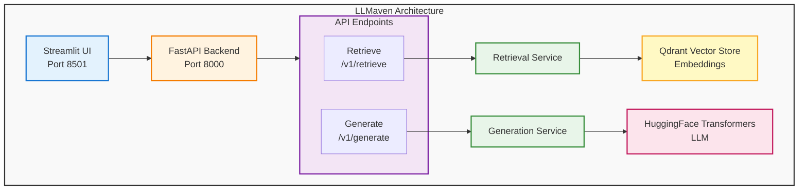

# LLMaven

An AI-powered tool library for scientific research using Retrieval Augmented Generation (RAG) with Large Language Models (LLMs). LLMaven provides open, transparent, and useful AI-based software for scientific discovery by leveraging publicly available diverse datasets and disparate academic knowledge bases.

## Overview

LLMaven's scientific goal is to create accessible AI tools for researchers who need to work with private/IP-sensitive data in a cost-effective manner. The project uses RAG-based LLMs to extend language models with domain-specific knowledge without requiring expensive model training or specialized hardware for individual researchers.

### Key Features

- **FastAPI Backend**: RESTful API with retrieval and generation endpoints
- **Streamlit Frontend**: Interactive chat interface for document Q&A
- **RAG Architecture**: Combines retrieval from vector databases with language model generation
- **Vector Database**: Qdrant-based document storage with semantic search (MMR - Maximal Marginal Relevance)
- **Flexible Models**:
  - Embedding models via HuggingFace (default: sentence-transformers/all-MiniLM-L12-v2)
  - Generation models via HuggingFace Transformers (default: allenai/OLMo-2-1124-7B-Instruct)
  - Quantization support (4-bit/8-bit) for efficient inference

## Architecture

LLMaven consists of several components that work together:



### Core Components

1. **FastAPI Backend** (`/src/llmaven/main.py`)
   - RESTful API with automatic OpenAPI documentation
   - CORS middleware for frontend integration
   - Error handling and validation
   - Health check endpoints

2. **Streamlit Frontend** (`/src/llmaven/frontend/app.py`)
   - Interactive chat interface
   - Document upload (PDF support)
   - Real-time retrieval and generation
   - Chat history display

3. **Retrieval Service** (`/src/llmaven/services/retrieval_service.py`)
   - Document embedding and vector storage
   - Semantic search using Qdrant
   - MMR (Maximal Marginal Relevance) retrieval
   - Support for temporary and persistent collections

4. **Generation Service** (`/src/llmaven/services/generation_service.py`)
   - Language model inference with caching
   - Quantized model loading (4-bit/8-bit)
   - HuggingFace Pipeline integration
   - Configurable generation parameters

## Installation

### Prerequisites

- Python 3.12+ (for LLMaven API)
- Python 3.11+ (for other components)
- [Pixi](https://pixi.sh) package manager

### Quick Start

1. **Install Pixi**:
   ```bash
   curl -fsSL https://pixi.sh/install.sh | bash
   ```

2. **Clone the repository**:
   ```bash
   git clone https://github.com/uw-ssec/llmaven.git
   cd llmaven
   ```

3. **Install dependencies**:
   ```bash
   pixi install
   ```

### Environment Setup

LLMaven uses multiple Pixi environments for different components:

- `llmaven`: Main API environment (Python 3.12)
- `frontend`: Streamlit UI environment
- `proxy`: OpenAI proxy service environment
- `infra`: Infrastructure management environment

## Usage

### Option 1: Using the LLMaven API and UI

The primary way to use LLMaven is through its FastAPI backend and Streamlit frontend.

#### 1. Start the API Server

```bash
# Using the pixi task (recommended)
pixi run -e llmaven api-server

# Or using the CLI directly
llmaven serve --env development --reload

# Production mode with multiple workers
llmaven serve --env production --workers 4
```

The API will be available at:
- API: http://localhost:8000
- API Documentation: http://localhost:8000/docs
- Alternative Docs: http://localhost:8000/redoc

#### 2. Start the Streamlit UI

In a separate terminal:

```bash
# Using the pixi task (recommended)
pixi run -e llmaven ui

# Or using the CLI directly
llmaven ui --port 8501
```

The UI will open automatically in your browser at http://localhost:8501

#### 3. Using the UI

1. **Upload Documents**: Use the file uploader to add PDF documents
2. **Ask Questions**: Type your question in the chat input
3. **View Results**: See retrieved document chunks and AI-generated answers
4. **Chat History**: All interactions are stored in the session

### Option 2: Using the Legacy Panel App (Archived)

**Note**: The Panel app is archived and located in `archive/legacy/`. It may still be functional but is no longer actively maintained.

For backward compatibility, you can use the original Panel-based application:

```bash
pixi run serve-panel
```

Open your browser at http://localhost:5006

### API Endpoints

#### Retrieval Endpoint

**POST** `/v1/retrieve`

Retrieve relevant documents based on a query.

```bash
curl -X POST http://localhost:8000/v1/retrieve \
  -H "Content-Type: application/json" \
  -d '{
    "query": "What is the Rubin telescope?",
    "embedding_model": "sentence-transformers/all-MiniLM-L12-v2",
    "existing_collection": "rubin_telescope",
    "existing_qdrant_path": "data/vector_stores/rubin_qdrant"
  }'
```

**Request Schema:**
```json
{
  "documents": [],  // Optional: List of documents to index temporarily
  "query": "string",  // Required: Search query
  "existing_collection": "string",  // Optional: Name of existing Qdrant collection
  "existing_qdrant_path": "string",  // Optional: Path to existing vector store
  "embedding_model": "string"  // Required: Embedding model to use
}
```

**Response:**
```json
{
  "docs": [
    {
      "page_content": "Document text...",
      "metadata": {...}
    }
  ],
  "status_code": 200
}
```

#### Generation Endpoint

**POST** `/v1/generate`

Generate text based on a prompt.

```bash
curl -X POST http://localhost:8000/v1/generate \
  -H "Content-Type: application/json" \
  -d '{
    "prompt": "Based on the context: ... Answer the question: ...",
    "generation_model": "allenai/OLMo-2-1124-7B-Instruct"
  }'
```

**Request Schema:**
```json
{
  "prompt": "string",  // Required: Full prompt with context
  "generation_model": "string"  // Required: Model name
}
```

**Response:**
```json
{
  "answer": "Generated text...",
  "status_code": 200
}
```

## Configuration

### Environment Variables

Create a `.env` file in the root directory:

```bash
# API Configuration
API_TITLE="LLMaven API"
API_VERSION="0.1.0"
API_CORS_ORIGINS=["*"]

# Frontend Configuration
FRONTEND_API_BASE_URL="http://localhost:8000/v1"
FRONTEND_EMBEDDING_MODEL="sentence-transformers/all-MiniLM-L12-v2"
FRONTEND_GENERATION_MODEL="allenai/OLMo-2-1124-7B-Instruct"
FRONTEND_EXISTING_COLLECTION="rubin_telescope"
FRONTEND_EXISTING_QDRANT_PATH="data/vector_stores/rubin_qdrant"
FRONTEND_RETRIEVAL_K=2

# Model Configuration
EMBEDDING_MODEL_NAME="intfloat/multilingual-e5-large-instruct"
```

### Model Configuration

#### Embedding Models

LLMaven supports any HuggingFace sentence-transformers model:

- `sentence-transformers/all-MiniLM-L12-v2` (default, lightweight)
- `intfloat/multilingual-e5-large-instruct` (multilingual)
- `sentence-transformers/all-mpnet-base-v2` (higher quality)

#### Generation Models

Supports HuggingFace Transformers models:

- `allenai/OLMo-2-1124-7B-Instruct` (default, 7B parameters)
- Any causal LM from HuggingFace

**Quantization Options:**
- 8-bit: Good balance of quality and memory
- 4-bit: Lower memory, slightly reduced quality

Models are cached locally in `src/llmaven/models/` directory.

## Project Structure

```
llmaven/
├── src/llmaven/              # Main application package
│   ├── __init__.py
│   ├── cli.py                # Command-line interface
│   ├── config.py             # API configuration
│   ├── main.py               # FastAPI application
│   ├── core/                 # Core RAG components
│   │   ├── embeddings/       # Embedding model wrapper
│   │   ├── generator/        # Language model wrapper
│   │   └── retriever/        # Vector retrieval logic
│   ├── frontend/             # Streamlit UI
│   │   ├── app.py            # Main UI application
│   │   └── config.py         # Frontend configuration
│   ├── schemas/              # Pydantic models
│   │   ├── retrieve.py       # Retrieval request/response
│   │   └── generate.py       # Generation request/response
│   ├── services/             # Business logic
│   │   ├── retrieval_service.py
│   │   └── generation_service.py
│   └── v1/                   # API v1 endpoints
│       ├── router.py         # Main router
│       └── endpoints/        # Endpoint implementations
│           ├── retrieve.py
│           └── generate.py
├── archive/                  # Archived code (unused)
│   ├── proxy/                # OpenAI API proxy service (archived)
│   │   ├── main.py           # Proxy server
│   │   ├── auth.py           # API key authentication
│   │   ├── data_log.py       # Request/response logging
│   │   └── README.md         # Proxy documentation
│   ├── infra/                # Infrastructure as code (archived)
│   │   ├── __main__.py       # Pulumi program
│   │   ├── users.py          # User management
│   │   └── README.md         # Infrastructure docs
│   └── legacy/               # Legacy Panel application (archived)
│       ├── rubin-panel-app.py # Original Panel app
│       └── vector_store.py   # Legacy vector store utilities
├── tests/                    # Test suite
│   ├── test_retriever.py
│   └── test_generator.py
├── pixi.toml                 # Pixi configuration
├── pyproject.toml            # Python package configuration
└── README.md                 # This file
```

## Development

### Running Tests

```bash
# Run all tests
pixi run -e llmaven pytest

# Run specific test file
pixi run -e llmaven pytest tests/test_retriever.py

# Run with verbose output
pixi run -e llmaven pytest -v
```

### Code Quality

The project uses pre-commit hooks for code quality:

```bash
# Install pre-commit hooks
pre-commit install

# Run manually
pre-commit run --all-files
```

Configured linters:
- flake8 (Python linting)
- black (code formatting - if enabled)

### Development Mode

Run the API server with auto-reload for development:

```bash
llmaven serve --env development --reload
```

Changes to Python files will automatically restart the server.

## Archived Components

The following components have been moved to the `archive/` directory and are no longer actively maintained:

### OpenAI Proxy Service (Archived)

An optional OpenAI API proxy for logging and usage tracking. Located in `archive/proxy/`.

**Features**:
- Full OpenAI API v1 compatibility
- Streaming support for chat completions
- Request/response logging
- Azure Blob Storage integration
- API key authentication

See `archive/proxy/README.md` for documentation.

### Infrastructure as Code (Archived)

Pulumi-based Azure infrastructure deployment. Located in `archive/infra/`.

**Resources**:
- Azure Resource Group
- Storage Account
- Table Storage
- Blob Storage containers

See `archive/infra/README.md` for documentation.

### Legacy Panel App (Archived)

Original Panel-based chat UI. Located in `archive/legacy/`.

See the "Option 2" in the Usage section above for running the legacy app.

## Vector Database Setup

To use LLMaven with your own documents, you need to create a Qdrant vector database:

1. **Prepare your documents**: PDF format supported out of the box
2. **Create vector database**: Use the provided notebook or create via API
3. **Configure paths**: Set `FRONTEND_EXISTING_COLLECTION` and `FRONTEND_EXISTING_QDRANT_PATH`

Example vector database creation workflow:
- See the [Quadrant Database Creation Notebook](https://github.com/uw-ssec/tutorials/blob/main/Archive/SciPy2024/appendix/qdrant-vector-database-creation.ipynb)

## CLI Reference

LLMaven provides a command-line interface:

```bash
# Start API server
llmaven serve [OPTIONS]

Options:
  --host TEXT         Host to bind (default: 0.0.0.0)
  --port INTEGER      Port to bind (default: 8000)
  --env TEXT          Environment: development|production
  --workers INTEGER   Number of workers (production only)
  --reload            Enable auto-reload (development only)

# Start Streamlit UI
llmaven ui [OPTIONS]

Options:
  --host TEXT         Host to bind (default: localhost)
  --port INTEGER      Port to bind (default: 8501)
  --browser/--no-browser  Open browser automatically

# Show version
llmaven version
```

## Troubleshooting

### Common Issues

1. **Port already in use**
   ```bash
   # Change the port
   llmaven serve --port 8001
   ```

2. **Model download fails**
   - Check internet connection
   - Verify HuggingFace model name
   - Check disk space (models can be several GB)

3. **Out of memory during generation**
   - Use 8-bit or 4-bit quantization
   - Reduce batch size
   - Use a smaller model

4. **Vector store not found**
   - Verify the path in configuration
   - Create vector store first using the notebook
   - Check file permissions

### Debugging

Enable debug logging:

```bash
# Set log level
export LOG_LEVEL=DEBUG

# Run with verbose output
llmaven serve --env development
```

View API logs at the console or check application logs.

## Contributing

Contributions are welcome! Please follow these guidelines:

1. Fork the repository
2. Create a feature branch
3. Make your changes
4. Run tests and linters
5. Submit a pull request

See [CODE_OF_CONDUCT.md](/Users/lsetiawan/Repos/SSEC/llmaven/CODE_OF_CONDUCT.md) for community guidelines.

## License

This project is licensed under the BSD License - see the [LICENSE](/Users/lsetiawan/Repos/SSEC/llmaven/LICENSE) file for details.


## Acknowledgments

- University of Washington Scientific Software Engineering Center (SSEC)
- Built with: FastAPI, Streamlit, LangChain, Qdrant, HuggingFace Transformers
- Inspired by the need for accessible AI tools in scientific research

## Additional Resources

- **Documentation**: See `/docs` folder (if available)
- **Tutorials**: [SSEC Tutorials](https://github.com/uw-ssec/tutorials)
- **Issues**: [GitHub Issues](https://github.com/uw-ssec/llmaven/issues)
- **AGENTS Guide**: [AGENTS.md](/Users/lsetiawan/Repos/SSEC/llmaven/AGENTS.md)

## Contact

For questions and support:
- Open an issue on GitHub
- Contact: UW SSEC Team

---

**Note**: This project is under active development. Features and APIs may change.
