# LLMaven Docker Infrastructure

LLMaven provides a complete containerized infrastructure for AI-powered scientific discovery, featuring LLM proxy services, experiment tracking, observability, and storage solutions.

## Table of Contents

1. [Overview](#overview)
2. [Architecture](#architecture)
3. [Prerequisites](#prerequisites)
4. [Quick Start](#quick-start)
5. [Services](#services)
6. [Configuration](#configuration)
7. [Usage](#usage)
8. [Pixi Integration](#pixi-integration)
9. [Monitoring and Logging](#monitoring-and-logging)
10. [Troubleshooting](#troubleshooting)
11. [Advanced Topics](#advanced-topics)
12. [Resources](#resources)

## Overview

This Docker setup provides a production-ready infrastructure for LLMaven that includes:

- **LiteLLM Proxy**: Unified interface for 100+ LLMs with load balancing, fallbacks, and cost tracking
- **MLflow**: Experiment tracking and model registry for machine learning workflows
- **PostgreSQL**: Relational database for storing configurations, metrics, and experiment data
- **MinIO**: S3-compatible object storage for artifacts, logs, and model storage

All services are orchestrated using Docker Compose and can be managed either directly with `docker-compose` commands or through convenient Pixi tasks.

### Directory Structure

```
docker/
├── docker-compose.yml          # Main orchestration file
├── .env.example                # Template for environment variables
├── config.yaml                 # LiteLLM proxy configuration
├── create_service_dbs.sql      # PostgreSQL database initialization
├── dockerfiles/
│   ├── litellm.dockerfile      # Custom LiteLLM image with mlflow
│   └── mlflow.dockerfile       # Custom MLflow image with dependencies
└── README.md                   # This file
```

**Important**: Copy `.env.example` to `.env` and configure your credentials before starting services.

## Architecture

```mermaid
graph TB
    subgraph "LLMaven Docker Stack"
        subgraph "Application Layer"
            LiteLLM["🤖 LiteLLM Proxy<br/>Port 4000<br/><br/>OpenAI-compatible API<br/>Multi-provider support<br/>Request logging"]
            MLflow["📊 MLflow Tracking<br/>Port 8080<br/><br/>Experiment tracking<br/>Model registry<br/>Metrics visualization"]
        end

        subgraph "Data Layer"
            PostgreSQL["🗄️ PostgreSQL<br/>Port 5432<br/><br/>Databases:<br/>• mlflow_db<br/>• litellm_db<br/>• llmaven"]
            MinIO["💾 MinIO S3 Storage<br/>API: 9000 | Console: 9001<br/><br/>Buckets:<br/>• mlflow (artifacts)<br/>• llmaven (general)"]
        end

        subgraph "External"
            Apps["📱 Applications<br/><br/>Python SDK<br/>cURL<br/>LangChain"]
            Providers["☁️ LLM Providers<br/><br/>Azure OpenAI<br/>OpenAI<br/>Anthropic"]
        end
    end

    Apps -->|"Chat Completions<br/>HTTP POST"| LiteLLM
    LiteLLM -->|"Route requests"| Providers
    LiteLLM -->|"Log requests/<br/>responses"| MLflow
    LiteLLM -->|"Store config<br/>& metrics"| PostgreSQL
    MLflow -->|"Store artifacts<br/>(models, plots)"| MinIO
    MLflow -->|"Store metadata<br/>(runs, params)"| PostgreSQL

    style LiteLLM fill:#e1f5ff,stroke:#01579b,stroke-width:2px
    style MLflow fill:#fff3e0,stroke:#e65100,stroke-width:2px
    style PostgreSQL fill:#f3e5f5,stroke:#4a148c,stroke-width:2px
    style MinIO fill:#e8f5e9,stroke:#1b5e20,stroke-width:2px
    style Apps fill:#fff,stroke:#666,stroke-width:2px,stroke-dasharray: 5 5
    style Providers fill:#fff,stroke:#666,stroke-width:2px,stroke-dasharray: 5 5
```



### Data Flow

1. **LLM Requests**: Applications send chat completion requests to LiteLLM Proxy (port 4000) using OpenAI-compatible API
2. **Request Routing**: LiteLLM routes requests to configured LLM providers (Azure OpenAI, OpenAI, Anthropic, etc.)
3. **Automatic Logging**: All requests and responses are automatically logged to MLflow for experiment tracking and analysis
4. **Artifact Storage**: MLflow stores model artifacts, plots, and experiment data in MinIO S3-compatible storage
5. **Metadata Storage**: Configuration, metrics, and run metadata are stored in PostgreSQL databases (mlflow_db, litellm_db)

## Prerequisites

### Required Software

- **Docker**: Version 20.10 or higher
- **Docker Compose**: Version 2.0 or higher

### Optional Software

- **Pixi**: For convenient task management (recommended)
  - Install from [pixi.sh](https://pixi.sh)
  - Provides simplified commands for managing the stack

### System Requirements

- **Minimum**: 4GB RAM, 10GB disk space
- **Recommended**: 8GB RAM, 20GB disk space
- **Ports**: Ensure the following ports are available:
  - 4000: LiteLLM Proxy
  - 5432: PostgreSQL
  - 8080: MLflow
  - 9000: MinIO API
  - 9001: MinIO Console

## Quick Start

### 1. Environment Setup

Copy the example environment file and configure your credentials:

```bash
# Navigate to the docker directory
cd docker
cp .env.example .env
```

Edit `.env` and configure at minimum:

```bash
# Required: Azure OpenAI credentials
AZURE_API_KEY=your-azure-api-key
AZURE_API_BASE=https://your-resource.openai.azure.com/
AZURE_API_VERSION=2024-12-01-preview

# Optional: Change default passwords (recommended for production)
POSTGRES_PASSWORD=your-secure-password
LITELLM_MASTER_KEY=your-master-key
```

### 2. Start Services

Choose one of the following methods:

#### Option A: Using Pixi (Recommended)

```bash
# From the project root directory
pixi run -e llmaven up
```

#### Option B: Using Docker Compose Directly

```bash
# From the docker directory
docker-compose up -d
```

**Note**: The first time you run this command, Docker will build custom images for LiteLLM and MLflow. This may take a few minutes. Subsequent starts will be much faster.

### 3. Verify Services

Check that all services are running:

```bash
# Using Pixi
pixi run -e llmaven status

# Using Docker Compose
docker-compose ps
```

Expected output should show all services as "healthy" or "running".

### 4. Access Services

Once all services are healthy:

- **LiteLLM UI**: http://localhost:4000
- **LiteLLM API Documentation**: http://localhost:4000/docs
- **MLflow UI**: http://localhost:8080
- **MinIO Console**: http://localhost:9001
  - Username: `minioadmin` (or your configured `MINIO_ROOT_USER`)
  - Password: `minioadmin` (or your configured `MINIO_ROOT_PASSWORD`)

## Services

### LiteLLM Proxy

**Purpose**: Unified API gateway for multiple LLM providers

**Image**: Custom build from `dockerfiles/litellm.dockerfile`
- Base image: `ghcr.io/berriai/litellm:v1.79.1-stable`
- Pre-installed packages: `mlflow==3.6.0`

**Ports**:
- `4000:4000`: LiteLLM Proxy API - hardcoded mapping

**Features**:
- OpenAI-compatible API interface
- Support for 100+ LLM providers
- Request/response logging to MLflow
- Cost tracking and usage monitoring
- Load balancing and fallback support
- API key management with master key authentication

**Configuration**: `config.yaml` in the docker directory
- Copied into the image at build time at `/app/config.yaml`

**Container Name**: `llmaven_litellm`

**Network**: `llmaven-network`

**Dependencies**: Waits for PostgreSQL (healthy) and MLflow (healthy)

**Startup Command**:
  - `litellm --config /app/config.yaml`

**Restart Policy**: Not explicitly set (defaults to `no` - doesn't restart automatically)

**Health Check**:
  - Interval: 30s
  - Timeout: 10s
  - Retries: 3
  - Start period: 40s (grace period before first check)
  - Command: `wget --no-verbose --tries=1 http://localhost:4000/health/liveliness`

**Key Environment Variables**:
- `LITELLM_MASTER_KEY`: Master authentication key
- `DATABASE_URL`: PostgreSQL connection string for LiteLLM data
- `MLFLOW_TRACKING_URI`: MLflow server endpoint for logging

### MLflow

**Purpose**: Experiment tracking, model registry, and ML lifecycle management

**Image**: Custom build from `dockerfiles/mlflow.dockerfile`
- Base image: `ghcr.io/mlflow/mlflow:v3.6.0`
- Pre-installed packages: `psycopg2-binary==2.9.11`, `boto3==1.40.73`

**Ports**:
- `${MLFLOW_PORT}:${MLFLOW_PORT}`: MLflow UI/API (default: 8080:8080) - uses environment variable

**Features**:
- Experiment tracking and comparison
- Model versioning and registry
- Artifact storage in MinIO
- Metrics visualization
- Model deployment capabilities
- CORS enabled for cross-origin requests
- Allows connections from all hosts

**Database**: Uses `mlflow_db` in PostgreSQL for backend storage

**Artifact Storage**: Uses MinIO bucket `mlflow` for artifacts

**Container Name**: `llmaven_mlflow`

**Network**: `llmaven-network`

**Dependencies**: Waits for PostgreSQL (healthy), MinIO (healthy), and createbuckets (completed successfully)

**Startup Command**: MLflow server with:
  - `--allowed-hosts '*'`: Accepts connections from any hostname
  - `--cors-allowed-origins '*'`: Enables CORS for all origins

**Restart Policy**: `always` - automatically restarts if the container stops

**Health Check**:
  - Interval: 10s
  - Timeout: 5s
  - Retries: 30
  - Uses Python urllib to check `/health` endpoint

**Key Environment Variables**:
- `MLFLOW_BACKEND_STORE_URI`: PostgreSQL connection for metadata
- `MLFLOW_DEFAULT_ARTIFACT_ROOT`: S3 path for artifacts (s3://mlflow/)
- `MLFLOW_S3_ENDPOINT_URL`: MinIO endpoint for S3-compatible storage
- `AWS_ACCESS_KEY_ID`: MinIO access credentials
- `AWS_SECRET_ACCESS_KEY`: MinIO secret credentials

### PostgreSQL

**Purpose**: Relational database for service metadata and configurations

**Image**: `postgres:16`

**Ports**:
- `${POSTGRES_PORT}:5432`: PostgreSQL database (default: 5432:5432) - uses environment variable

**Volume Mounts**:
- `postgres_data:/var/lib/postgresql/data`: PostgreSQL data directory
- `./create_service_dbs.sql:/docker-entrypoint-initdb.d/create_service_dbs.sql`: Database initialization script

**Databases Created**:
- `llmaven`: Main database (default)
- `mlflow_db`: MLflow backend storage
- `litellm_db`: LiteLLM proxy storage

**Initialization**: Automatically runs `/Users/lsetiawan/Repos/SSEC/llmaven/docker/create_service_dbs.sql` on first startup

**Data Persistence**: Uses named volume `llmaven_postgres_data`

**Container Name**: `llmaven_db`

**Network**: `llmaven-network` (bridge driver)

**Restart Policy**: `always` - automatically restarts if the container stops

**Health Check**:
  - Interval: 10s
  - Timeout: 5s
  - Retries: 5
  - Command: `pg_isready -U ${POSTGRES_USER} -d ${POSTGRES_DB}`

**Key Environment Variables**:
- `POSTGRES_USER`: Database admin user (default: llmaven-admin)
- `POSTGRES_PASSWORD`: Database password
- `POSTGRES_DB`: Default database name
- `POSTGRES_PORT`: Exposed port (default: 5432)

### MinIO

**Purpose**: S3-compatible object storage for artifacts and logs

**Image**: `minio/minio:latest`

**Buckets Created**:
- `mlflow`: MLflow artifacts (models, plots, data)
- `llmaven`: General LLMaven storage

**Ports**:
- `9000:9000`: MinIO API (S3-compatible) - hardcoded mapping
- `9001:9001`: Web Console UI - hardcoded mapping

**Volume Mounts**:
- `minio_data:/data`: MinIO data directory

**Server Command**: `server /data --console-address ":9001"`
  - Serves data from `/data` directory
  - Exposes console on port 9001

**Data Persistence**: Uses volume `minio_data` (local driver)

**Bucket Creation**: Automated via `createbuckets` service on startup
  - Uses MinIO Client (`mc`) image: `quay.io/minio/mc:latest`
  - Creates buckets: `mlflow` and `llmaven`
  - Restart policy: `on-failure` - retries only if it fails
  - Uses alias `dockerminio` for MinIO connection
  - Exits successfully (code 0) after creating buckets

**Container Name**: `llmaven_minio`

**Network**: `llmaven-network` (bridge driver)

**Restart Policy**: `always` - automatically restarts if the container stops

**Health Check**:
  - Interval: 30s
  - Timeout: 20s
  - Retries: 3
  - Command: `curl -f http://localhost:9000/minio/health/live`

**Key Environment Variables**:
- `MINIO_ROOT_USER`: Admin username (default: minioadmin, or uses AWS_ACCESS_KEY_ID)
- `MINIO_ROOT_PASSWORD`: Admin password (default: minioadmin, or uses AWS_SECRET_ACCESS_KEY)
- `S3_ENDPOINT_URL`: MinIO API endpoint (constructed from MINIO_HOST and MINIO_PORT)

## Configuration

### Environment Variables

The `.env` file contains all configuration for the Docker stack. See `.env.example` for a complete reference.

**Important**: All services load environment variables from the `.env` file using `env_file: - .env` in their Docker Compose configuration. Make sure the `.env` file exists before starting services.

#### Core Database Configuration

```bash
# Postgres Configuration
POSTGRES_HOST=${POSTGRES_HOST:-db}  # Database hostname (defaults to 'db')
POSTGRES_DB=llmaven                 # Default database
POSTGRES_USER=llmaven-admin         # Admin user
POSTGRES_PASSWORD=dbpassword9090    # Change in production!
POSTGRES_PORT=5432                  # PostgreSQL port
```

#### MinIO/S3 Configuration

```bash
# MinIO Configuration
MINIO_HOST=${MINIO_HOST:-minio}                               # MinIO hostname (defaults to 'minio')
MINIO_PORT=9000                                               # MinIO API port
MINIO_ROOT_USER=${AWS_ACCESS_KEY_ID:-minioadmin}             # MinIO admin user
MINIO_ROOT_PASSWORD=${AWS_SECRET_ACCESS_KEY:-minioadmin}     # MinIO admin password
S3_ENDPOINT_URL=http://${MINIO_HOST}:${MINIO_PORT}           # Internal S3 endpoint (uses variables)

# AWS/S3 Credentials (set to MinIO credentials)
AWS_ACCESS_KEY_ID=${MINIO_ROOT_USER}                         # Uses MinIO root user
AWS_SECRET_ACCESS_KEY=${MINIO_ROOT_PASSWORD}                 # Uses MinIO root password
```

**Note**: The MinIO and AWS credentials use variable references to keep them in sync. By default, both use `minioadmin`, but you can override them by setting `AWS_ACCESS_KEY_ID` and `AWS_SECRET_ACCESS_KEY`.

#### MLflow Configuration

```bash
# MLflow Configuration
MLFLOW_HOST=${MLFLOW_HOST:-mlflow}                                                              # MLflow hostname (defaults to 'mlflow')
MLFLOW_PORT=8080                                                                                 # MLflow UI/API port
MLFLOW_BACKEND_STORE_URI=postgresql://${POSTGRES_USER}:${POSTGRES_PASSWORD}@${POSTGRES_HOST}:${POSTGRES_PORT}/mlflow_db
MLFLOW_DEFAULT_ARTIFACT_ROOT=s3://mlflow/
MLFLOW_S3_ENDPOINT_URL=${S3_ENDPOINT_URL}                                                       # Uses S3_ENDPOINT_URL variable
MLFLOW_S3_IGNORE_TLS="true"                                                                     # Required for local MinIO
```

**Note**: The MLflow Docker image is built with `psycopg2-binary` and `boto3` pre-installed (see `dockerfiles/mlflow.dockerfile`).

#### LiteLLM Configuration

```bash
# LiteLLM Configuration
LITELLM_DB=litellm_db
LITELLM_DATABASE_URL=postgresql://${POSTGRES_USER}:${POSTGRES_PASSWORD}@${POSTGRES_HOST}:${POSTGRES_PORT}/litellm_db
DATABASE_URL=${LITELLM_DATABASE_URL}                                  # Required by LiteLLM
MLFLOW_TRACKING_URI=http://${MLFLOW_HOST}:${MLFLOW_PORT}             # Uses MLflow variables
MLFLOW_EXPERIMENT_NAME="Default"
LITELLM_MASTER_KEY=sk-1234                                            # Change in production!
```

**Note**: The LiteLLM Docker image is built with `mlflow` pre-installed (see `dockerfiles/litellm.dockerfile`).

#### LLM Provider API Keys

```bash
# Azure OpenAI (Required for default config.yaml)
AZURE_API_KEY=your-azure-api-key
AZURE_API_BASE=https://your-resource.openai.azure.com/
AZURE_API_VERSION=2024-12-01-preview

# OpenAI (Optional)
# OPENAI_API_KEY=your-openai-api-key

# Anthropic (Optional)
# ANTHROPIC_API_KEY=your-anthropic-api-key
```

### LiteLLM Model Configuration

The file `config.yaml` defines LLM models and routing:

```yaml
model_list:
  # Azure OpenAI Models
  - model_name: gpt-5-mini
    litellm_params:
      model: azure/gpt-5-mini
      api_base: os.environ/AZURE_API_BASE
      api_key: os.environ/AZURE_API_KEY
      api_version: os.environ/AZURE_API_VERSION

# Logging Configuration - Push to MLflow
litellm_settings:
  success_callback: ["mlflow"]
  failure_callback: ["mlflow"]

# General settings
general_settings:
  master_key: os.environ/LITELLM_MASTER_KEY
  database_url: os.environ/DATABASE_URL
  store_prompts_in_spend_logs: true
  store_model_in_db: true
```

#### Adding More Models

To add additional models or providers, edit `config.yaml`:

```yaml
model_list:
  # Add OpenAI GPT-4
  - model_name: gpt-4
    litellm_params:
      model: openai/gpt-4
      api_key: os.environ/OPENAI_API_KEY

  # Add Anthropic Claude
  - model_name: claude-3-sonnet
    litellm_params:
      model: anthropic/claude-3-sonnet-20240229
      api_key: os.environ/ANTHROPIC_API_KEY
```

Then add the corresponding API keys to your `.env` file.

#### Alternative: S3 Logging

To enable S3 logging instead of MLflow logging, edit `config.yaml` and replace the current `litellm_settings` section with:

```yaml
litellm_settings:
  set_verbose: true
  success_callback: ["s3"]
  failure_callback: ["s3"]
  s3_callback_params:
    s3_bucket_name: os.environ/S3_BUCKET_NAME
    s3_region_name: os.environ/S3_REGION_NAME
    s3_aws_access_key_id: os.environ/AWS_ACCESS_KEY_ID
    s3_aws_secret_access_key: os.environ/AWS_SECRET_ACCESS_KEY
    s3_endpoint_url: os.environ/AWS_ENDPOINT_URL
    s3_path: os.environ/S3_PATH_PREFIX
```

Then add the corresponding environment variables to your `.env` file and rebuild the LiteLLM image:

```bash
# Add to .env
S3_BUCKET_NAME=llmaven
S3_REGION_NAME=us-east-1
S3_PATH_PREFIX=litellm-logs/

# Rebuild LiteLLM image to include updated config.yaml
docker-compose build litellm
docker-compose up -d litellm
```

### Custom Docker Images

LLMaven uses custom Docker images for LiteLLM and MLflow to pre-install required dependencies, improving startup time and reliability.

#### MLflow Dockerfile

Located at `dockerfiles/mlflow.dockerfile`:

```dockerfile
FROM ghcr.io/mlflow/mlflow:v3.6.0

RUN pip install --no-cache-dir "psycopg2-binary==2.9.11" "boto3==1.40.73"

ENTRYPOINT ["mlflow", "server"]
```

Pre-installs PostgreSQL database adapter and AWS S3 client for artifact storage.

#### LiteLLM Dockerfile

Located at `dockerfiles/litellm.dockerfile`:

```dockerfile
FROM ghcr.io/berriai/litellm:v1.79.1-stable

RUN pip install --no-cache-dir "mlflow==3.6.0"

RUN mkdir -p /app

COPY config.yaml /app/config.yaml
```

Pre-installs MLflow for logging integration and copies the LiteLLM configuration file into the image.

**Building the Images**: The images are automatically built when you run `docker-compose up` or `pixi run -e llmaven up`. To rebuild after changes:

```bash
# Rebuild all custom images
docker-compose build

# Rebuild specific service
docker-compose build mlflow
docker-compose build litellm

# Force rebuild without cache
docker-compose build --no-cache
```

### Database Initialization

The file `create_service_dbs.sql` automatically creates required databases on first startup:

- Creates `mlflow_db` for MLflow backend storage
- Creates `litellm_db` for LiteLLM proxy data
- Grants appropriate privileges to the configured user
- Script is idempotent (safe to run multiple times)

## Usage

### Making LLM Requests

#### Using cURL

```bash
curl http://localhost:4000/v1/chat/completions \
  -H "Content-Type: application/json" \
  -H "Authorization: Bearer sk-1234" \
  -d '{
    "model": "gpt-5-mini",
    "messages": [
      {"role": "user", "content": "Explain quantum entanglement"}
    ]
  }'
```

#### Using OpenAI Python SDK

```python
from openai import OpenAI

# Configure client to use LiteLLM proxy
client = OpenAI(
    base_url="http://localhost:4000",
    api_key="sk-1234"  # Your LITELLM_MASTER_KEY
)

# Make a chat completion request
response = client.chat.completions.create(
    model="gpt-5-mini",
    messages=[
        {"role": "system", "content": "You are a helpful scientific assistant."},
        {"role": "user", "content": "What is the significance of the Higgs boson?"}
    ]
)

print(response.choices[0].message.content)
```

#### Using LangChain

```python
from langchain_openai import ChatOpenAI

# Configure LangChain to use LiteLLM proxy
llm = ChatOpenAI(
    model="gpt-5-mini",
    openai_api_key="sk-1234",
    openai_api_base="http://localhost:4000"
)

# Make a request
response = llm.invoke("Explain the theory of relativity")
print(response.content)
```

### Tracking Experiments with MLflow

All LLM requests are automatically logged to MLflow. Access the UI at http://localhost:8080 to:

- View request/response history
- Compare model performance
- Track costs and token usage
- Analyze response patterns

**Note**: By default, LiteLLM logs to the "Default" experiment. You can customize this by setting `MLFLOW_EXPERIMENT_NAME` in your `.env` file.

#### Programmatic MLflow Access

```python
import mlflow

# Set tracking URI
mlflow.set_tracking_uri("http://localhost:8080")

# Get experiment by name
experiment = mlflow.get_experiment_by_name("Default")

# Search runs
runs = mlflow.search_runs(experiment_ids=[experiment.experiment_id])
print(runs[['run_id', 'metrics.total_cost', 'params.model']])
```

### Managing Storage with MinIO

Access the MinIO console at http://localhost:9001 to:

- Browse buckets and objects
- Upload/download files
- Manage access policies
- Monitor storage usage

#### Using MinIO Client (mc)

```bash
# Configure MinIO client (use 'dockerminio' as alias to match the setup)
docker exec -it llmaven_minio mc alias set dockerminio http://localhost:9000 minioadmin minioadmin

# List buckets
docker exec -it llmaven_minio mc ls dockerminio/

# List objects in mlflow bucket
docker exec -it llmaven_minio mc ls dockerminio/mlflow/

# Copy file to bucket
docker exec -it llmaven_minio mc cp myfile.txt dockerminio/llmaven/
```

**Note**: The `createbuckets` service uses the alias `dockerminio` internally. You can use any alias name for your own `mc` commands.

#### Using Python boto3

```python
import boto3
from botocore.client import Config

# Configure S3 client for MinIO
s3_client = boto3.client(
    's3',
    endpoint_url='http://localhost:9000',
    aws_access_key_id='minioadmin',
    aws_secret_access_key='minioadmin',
    config=Config(signature_version='s3v4'),
    region_name='us-east-1'
)

# List buckets
response = s3_client.list_buckets()
for bucket in response['Buckets']:
    print(bucket['Name'])

# Upload file
s3_client.upload_file('local_file.txt', 'llmaven', 'remote_file.txt')

# Download file
s3_client.download_file('llmaven', 'remote_file.txt', 'downloaded_file.txt')
```

## Docker Compose Infrastructure

### Volumes

The Docker Compose setup uses two persistent volumes:

```yaml
volumes:
  postgres_data:
    name: llmaven_postgres_data  # Named volume for Postgres data persistence
  minio_data:
    driver: local                # Local driver for MinIO data
```

- **llmaven_postgres_data**: Named volume for PostgreSQL database files
  - Persists database data across container restarts and recreations
  - Explicitly named as `llmaven_postgres_data`
  - Contains all PostgreSQL databases (`llmaven`, `mlflow_db`, `litellm_db`)

- **minio_data**: Local volume for MinIO object storage
  - Persists S3-compatible object data (artifacts, logs, models)
  - Uses default local driver
  - Contains all MinIO buckets (`mlflow`, `llmaven`)

### Networks

All services communicate through a single bridge network:

```yaml
networks:
  llmaven-network:
    driver: bridge  # Bridge network for service communication
```

- **llmaven-network**: Bridge network connecting all services
  - Driver: `bridge` (default Docker network driver)
  - Enables container-to-container communication
  - Services can reference each other by service name (e.g., `db`, `minio`, `mlflow`, `litellm`)
  - Internal DNS resolution provided by Docker
  - Isolated from host network for security

### Service Dependencies

The services have the following startup order enforced by `depends_on`:

1. **PostgreSQL (`db`)**: Starts first (no dependencies)
2. **MinIO (`minio`)**: Starts first (no dependencies)
3. **Create Buckets (`createbuckets`)**: Waits for MinIO to be healthy
4. **MLflow (`mlflow`)**: Waits for PostgreSQL (healthy), MinIO (healthy), and createbuckets (completed)
5. **LiteLLM (`litellm`)**: Waits for PostgreSQL (healthy) and MLflow (healthy)

This dependency chain ensures all required infrastructure is ready before dependent services start.

## Pixi Integration

LLMaven integrates with [Pixi](https://pixi.sh), a modern package manager for reproducible development environments. The docker infrastructure is managed through the `llmaven` Pixi environment.

### Available Pixi Tasks

From the `pixi.toml` configuration in the project root:

```bash
# Start all services
pixi run -e llmaven up

# Stop all services
pixi run -e llmaven down

# View service logs (follow mode)
pixi run -e llmaven logs

# Check service status
pixi run -e llmaven status

# Restart all services
pixi run -e llmaven restart

# Clean up (stops services and removes volumes - WARNING: deletes data)
pixi run -e llmaven clean
```

### How Pixi Tasks Work

Each task is defined in `pixi.toml` under the `[feature.docker.tasks]` section:

```toml
[feature.docker.tasks]
up = { cmd = "docker-compose up -d", cwd = "docker" }
down = { cmd = "docker-compose down", cwd = "docker" }
logs = { cmd = "docker-compose logs -f", cwd = "docker" }
status = { cmd = "docker-compose ps", cwd = "docker" }
restart = { cmd = "docker-compose restart", cwd = "docker" }
clean = { cmd = "docker-compose down -v", cwd = "docker" }
```

The `cwd = "docker"` ensures commands run from the correct directory.

### Installing Pixi

If you don't have Pixi installed:

```bash
# macOS/Linux
curl -fsSL https://pixi.sh/install.sh | bash

# Or using Homebrew (macOS)
brew install pixi

# Windows
iwr -useb https://pixi.sh/install.ps1 | iex
```

After installation, initialize the environment:

```bash
# Navigate to the project root
cd path/to/llmaven
pixi install
```

## Monitoring and Logging

### Service Health Checks

All services include health checks configured in `docker-compose.yml`:

#### PostgreSQL Health Check

```bash
# Check database health
docker-compose exec db pg_isready -U llmaven-admin -d llmaven

# Connect to database
docker-compose exec db psql -U llmaven-admin -d llmaven
```

#### LiteLLM Health Check

```bash
# Check liveness (used by Docker health check)
curl http://localhost:4000/health/liveliness

# Alternative using wget
wget --no-verbose --tries=1 http://localhost:4000/health/liveliness
```

#### MLflow Health Check

```bash
# Check MLflow health endpoint
curl http://localhost:8080/health

# Using Python (as used by Docker health check)
python -c "import urllib.request; urllib.request.urlopen('http://localhost:8080/health')"
```

#### MinIO Health Check

```bash
# Check MinIO health
curl http://localhost:9000/minio/health/live
```

### Viewing Logs

#### All Services

```bash
# Using Pixi
pixi run -e llmaven logs

# Using Docker Compose
docker-compose logs -f
```

#### Specific Service

```bash
# LiteLLM logs
docker-compose logs -f litellm

# MLflow logs
docker-compose logs -f mlflow

# PostgreSQL logs
docker-compose logs -f db

# MinIO logs
docker-compose logs -f minio
```

#### Last N Lines

```bash
# Last 100 lines of LiteLLM logs
docker-compose logs --tail=100 litellm
```

### MLflow Experiment Tracking

All LiteLLM requests are automatically logged to MLflow:

1. Open MLflow UI: http://localhost:8080
2. Navigate to the experiment (default: "Default", or custom name set via `MLFLOW_EXPERIMENT_NAME`)
3. View runs showing:
   - Model used
   - Prompt and completion
   - Token counts
   - Response time
   - Estimated cost

## Troubleshooting

### Services Fail to Start

**Symptom**: Services exit or restart repeatedly

**Diagnosis**:

```bash
# Check service status
docker-compose ps

# View logs for failing service
docker-compose logs <service-name>
```

**Common Causes**:

1. **Port conflicts**: Another service using required ports
   ```bash
   # Check port usage
   lsof -i :4000
   lsof -i :5432
   lsof -i :8080
   lsof -i :9000
   lsof -i :9001
   ```

   **Solution**: Stop conflicting services or change ports in `.env`

2. **Missing environment variables**: Required variables not set in `.env`

   **Solution**: Ensure all required variables from `.env.example` are set

3. **Database initialization failure**: PostgreSQL startup issues
   ```bash
   # Check PostgreSQL logs
   docker-compose logs db
   ```

   **Solution**: Verify database credentials in `.env`

### LiteLLM Connection Errors

**Symptom**: 500 errors when calling LiteLLM API

**Diagnosis**:

```bash
# Check LiteLLM logs
docker-compose logs litellm

# Test health endpoint
curl http://localhost:4000/health/liveliness
```

**Common Causes**:

1. **Invalid API keys**: Azure/OpenAI credentials incorrect

   **Solution**: Verify API keys in `.env` are correct

2. **Database connection failure**: Cannot connect to PostgreSQL

   **Solution**: Ensure PostgreSQL is healthy and credentials match

3. **MLflow connection failure**: Cannot connect to MLflow

   **Solution**: Verify MLflow is running and healthy

### MLflow Cannot Store Artifacts

**Symptom**: MLflow logs show S3 connection errors

**Diagnosis**:

```bash
# Check MLflow logs
docker-compose logs mlflow

# Verify MinIO is running
docker-compose ps minio

# Check MinIO buckets
docker exec -it llmaven_minio mc ls local/
```

**Common Causes**:

1. **MinIO not ready**: Buckets not created

   **Solution**: Verify `createbuckets` service completed successfully:
   ```bash
   docker-compose logs createbuckets
   ```

2. **Incorrect S3 credentials**: MinIO credentials mismatch

   **Solution**: Ensure `AWS_ACCESS_KEY_ID` and `AWS_SECRET_ACCESS_KEY` match MinIO configuration

3. **Missing bucket**: MLflow bucket doesn't exist

   **Solution**: Manually create bucket:
   ```bash
   # First set up the alias if not already done
   docker exec -it llmaven_minio mc alias set dockerminio http://localhost:9000 minioadmin minioadmin
   # Then create the bucket
   docker exec -it llmaven_minio mc mb dockerminio/mlflow
   ```

### Database Connection Refused

**Symptom**: Services cannot connect to PostgreSQL

**Diagnosis**:

```bash
# Check PostgreSQL is running
docker-compose ps db

# Test connection
docker-compose exec db psql -U llmaven-admin -d llmaven -c "SELECT 1;"
```

**Common Causes**:

1. **PostgreSQL not started**: Database container not running

   **Solution**: Start database:
   ```bash
   docker-compose up -d db
   ```

2. **Wrong credentials**: Username/password mismatch

   **Solution**: Verify `POSTGRES_USER` and `POSTGRES_PASSWORD` in `.env`

3. **Database not initialized**: Service databases not created

   **Solution**: Check initialization logs:
   ```bash
   docker-compose logs db | grep -A 10 "create_service_dbs"
   ```

### Complete Reset

If all else fails, perform a complete reset:

```bash
# Stop all services and remove volumes
pixi run -e llmaven clean

# Or using Docker Compose
docker-compose down -v

# Remove any orphaned volumes
docker volume prune

# Start fresh
pixi run -e llmaven up
```

**WARNING**: This deletes all data including:
- PostgreSQL databases
- MLflow experiments
- MinIO stored objects

## Advanced Topics

### Production Deployment Considerations

#### Security Hardening

1. **Change Default Passwords**:
   ```bash
   # In .env
   POSTGRES_PASSWORD=<strong-random-password>
   LITELLM_MASTER_KEY=sk-<strong-random-key>
   MINIO_ROOT_PASSWORD=<strong-random-password>
   ```

2. **Use Secret Management**:
   - Store credentials in HashiCorp Vault, AWS Secrets Manager, or Azure Key Vault
   - Mount secrets as files instead of environment variables

3. **Enable TLS/HTTPS**:
   - Configure reverse proxy (nginx, Traefik) with SSL certificates
   - Enable HTTPS for all services

4. **Network Isolation**:
   - Use Docker networks to isolate services
   - Expose only necessary ports to host
   - Use firewall rules to restrict access

#### Scaling Considerations

1. **PostgreSQL**:
   - Use managed database service (AWS RDS, Azure Database, Google Cloud SQL)
   - Configure connection pooling
   - Set up replication for high availability

2. **MinIO**:
   - Use managed S3 service (AWS S3, Azure Blob, Google Cloud Storage)
   - Enable distributed mode for multi-node setup
   - Configure erasure coding for data protection

3. **LiteLLM**:
   - Run multiple instances behind load balancer
   - Use Redis for shared caching
   - Configure rate limiting and quotas

4. **MLflow**:
   - Use managed artifact store
   - Deploy MLflow on Kubernetes for auto-scaling
   - Configure authentication and authorization

#### Backup Strategies

1. **PostgreSQL Backup**:
   ```bash
   # Backup all databases
   docker-compose exec db pg_dumpall -U llmaven-admin > backup_$(date +%Y%m%d).sql

   # Restore
   docker-compose exec -T db psql -U llmaven-admin < backup_20240101.sql
   ```

2. **MinIO Backup**:
   ```bash
   # Mirror bucket to another MinIO instance
   docker exec -it llmaven_minio mc mirror dockerminio/mlflow remote/mlflow-backup
   ```

3. **Automated Backups**:
   - Set up cron jobs for regular backups
   - Use volume snapshots for quick recovery
   - Store backups in separate location/region

### Custom Model Integration

#### Adding Local LLaMA Model

1. Download model weights
2. Update `config.yaml`:
   ```yaml
   model_list:
     - model_name: llama-2-7b
       litellm_params:
         model: ollama/llama2
         api_base: http://ollama:11434
   ```

3. Add Ollama service to `docker-compose.yml`:
   ```yaml
   ollama:
     image: ollama/ollama:latest
     container_name: llmaven_ollama
     ports:
       - "11434:11434"
     volumes:
       - ollama_data:/root/.ollama
     networks:
       - llmaven-network
   ```

#### Adding HuggingFace Model

Update `config.yaml`:
```yaml
model_list:
  - model_name: falcon-7b
    litellm_params:
      model: huggingface/tiiuae/falcon-7b-instruct
      api_key: os.environ/HUGGINGFACE_API_KEY
```

Add `HUGGINGFACE_API_KEY` to `.env`.

### Custom Logging and Callbacks

LiteLLM supports multiple callback integrations. Edit `config.yaml`:

```yaml
litellm_settings:
  # Multiple callbacks
  success_callback: ["mlflow", "s3", "langfuse"]
  failure_callback: ["mlflow", "s3"]

  # Langfuse configuration
  langfuse_public_key: os.environ/LANGFUSE_PUBLIC_KEY
  langfuse_secret_key: os.environ/LANGFUSE_SECRET_KEY

  # Weights & Biases
  wandb_api_key: os.environ/WANDB_API_KEY
  wandb_project: "llmaven"
```

### Performance Tuning

#### PostgreSQL Optimization

Create `postgres.conf` and mount it:

```ini
# Performance tuning
shared_buffers = 256MB
effective_cache_size = 1GB
work_mem = 16MB
maintenance_work_mem = 128MB
max_connections = 100

# Logging
log_statement = 'all'
log_duration = on
```

Mount in `docker-compose.yml`:
```yaml
db:
  volumes:
    - ./postgres.conf:/etc/postgresql/postgresql.conf
  command: postgres -c config_file=/etc/postgresql/postgresql.conf
```

#### LiteLLM Caching

Enable Redis caching in `config.yaml`:

```yaml
litellm_settings:
  cache: true
  cache_params:
    type: "redis"
    host: "redis"
    port: 6379
```

Add Redis service to `docker-compose.yml`:
```yaml
redis:
  image: redis:7-alpine
  container_name: llmaven_redis
  ports:
    - "6379:6379"
  volumes:
    - redis_data:/data
  networks:
    - llmaven-network
```

### Integration with LLMaven Applications

#### Environment Variables for Applications

When running LLMaven applications that need to connect to these services:

```bash
# LiteLLM Proxy
export LITELLM_API_BASE=http://localhost:4000
export LITELLM_API_KEY=sk-1234

# MLflow Tracking
export MLFLOW_TRACKING_URI=http://localhost:8080

# MinIO S3
export AWS_ACCESS_KEY_ID=minioadmin
export AWS_SECRET_ACCESS_KEY=minioadmin
export AWS_ENDPOINT_URL=http://localhost:9000
```

#### Using with Jupyter Notebooks

```python
import os

# Configure environment
os.environ['LITELLM_API_BASE'] = 'http://localhost:4000'
os.environ['LITELLM_API_KEY'] = 'sk-1234'
os.environ['MLFLOW_TRACKING_URI'] = 'http://localhost:8080'

from openai import OpenAI
import mlflow

# Use LiteLLM
client = OpenAI(
    base_url=os.environ['LITELLM_API_BASE'],
    api_key=os.environ['LITELLM_API_KEY']
)

# Track with MLflow
mlflow.set_tracking_uri(os.environ['MLFLOW_TRACKING_URI'])
with mlflow.start_run():
    response = client.chat.completions.create(
        model="gpt-5-mini",
        messages=[{"role": "user", "content": "Hello!"}]
    )
    mlflow.log_param("model", "gpt-5-mini")
    mlflow.log_metric("response_length", len(response.choices[0].message.content))
```

## Resources

### Official Documentation

- **LiteLLM**: https://docs.litellm.ai/
  - [Proxy Server](https://docs.litellm.ai/docs/proxy/quick_start)
  - [Supported Models](https://docs.litellm.ai/docs/providers)
  - [Logging & Observability](https://docs.litellm.ai/docs/proxy/logging)

- **MLflow**: https://mlflow.org/docs/latest/index.html
  - [Tracking](https://mlflow.org/docs/latest/tracking.html)
  - [Models](https://mlflow.org/docs/latest/models.html)
  - [Model Registry](https://mlflow.org/docs/latest/model-registry.html)

- **MinIO**: https://min.io/docs/minio/linux/index.html
  - [Docker Deployment](https://min.io/docs/minio/container/index.html)
  - [S3 Compatibility](https://min.io/docs/minio/linux/integrations/aws-cli-with-minio.html)

- **PostgreSQL**: https://www.postgresql.org/docs/16/
  - [Docker Official Images](https://hub.docker.com/_/postgres)
  - [Performance Tuning](https://wiki.postgresql.org/wiki/Performance_Optimization)

### LLMaven Project

- **Main Repository**: https://github.com/uw-ssec/llmaven
- **Pixi Documentation**: https://pixi.sh/latest/
- **Issue Tracker**: https://github.com/uw-ssec/llmaven/issues

### Community and Support

- **LiteLLM Discord**: https://discord.com/invite/wuPM9dRgDw
- **MLflow Slack**: https://mlflow.org/slack
- **MinIO Slack**: https://slack.min.io/

---

**Note**: This documentation is for the LLMaven Docker infrastructure. For information about the main LLMaven application and features, see the [root README](../README.md).
